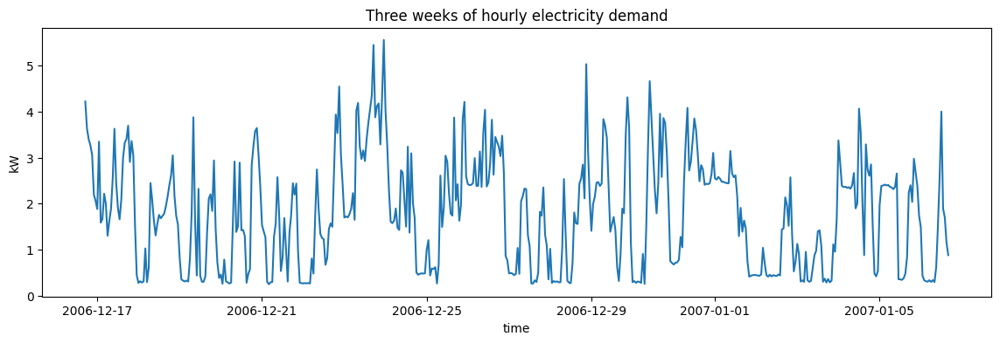
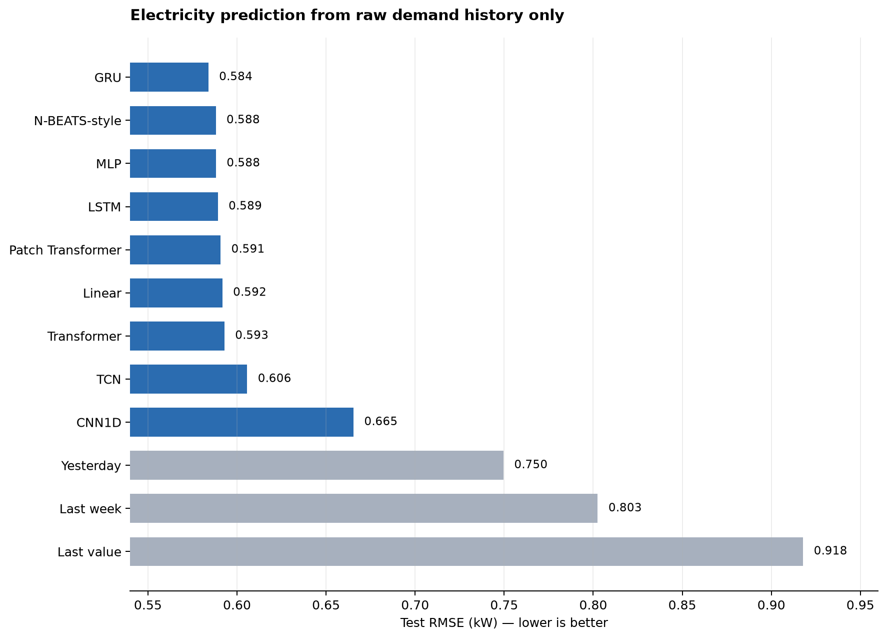

# Comparing Sequence Models on Electricity Prediction

*What happens when nine very different architectures receive exactly the same week of raw demand history?*

**Series:** Sequence Models for Prediction, Part 15 of 18
**Suggested Medium tags:** Time Series, Deep Learning, Forecasting, Model Evaluation, Data Science

The previous articles studied sequence models one at a time. That was deliberate: an architecture is easier to understand when its mechanics are not buried inside a leaderboard.

Now we can ask the practical question.

> If every model sees the same raw sequence, which architecture predicts the next day most accurately?

This first comparison does **not** use calendar variables, explicit lags, rolling statistics, or other engineered features. Each model receives only a week of hourly electricity demand. That restriction lets us compare the algorithms before changing the information presented to them.

The result is not a dramatic victory for a single modern architecture. It is a much more useful finding: several fundamentally different models produce remarkably similar forecasts, and a well-matched simple model can remain competitive with a sophisticated one.

## The prediction task

The experiment uses the UCI Individual Household Electric Power Consumption data, aggregated to hourly demand. After resampling and causal filling of missing hours, the usable series contains 34,589 observations from December 2006 through November 2010.



At each forecast origin, a model receives the previous 168 hours—exactly one week—and predicts the next 24 hours in one shot:

```text
input:   demand[t-168], ..., demand[t-1]
output:  demand[t],     ..., demand[t+23]
```

In tensor form, every model starts from the same input and output contract:

```text
X: [batch, 168, 1]
y: [batch, 24]
```

The final historical week is not fed back one hour at a time during inference. Each architecture maps the complete observed window directly to the complete 24-hour future path. This avoids error accumulation from recursive forecasting and keeps the output task identical across model families.

## A chronological evaluation

Time order is preserved throughout the experiment. The data is divided chronologically into 70% training, 15% validation, and 15% test segments. Scaling statistics are fitted on the training period only.

After window construction, the split contains:

| Segment | Forecast origins |
|---|---:|
| Training | 23,853 |
| Validation | 5,165 |
| Test | 5,166 |

Every model is evaluated on the same test origins. The principal metric is root mean squared error, or RMSE, measured in kilowatts after predictions are transformed back to the original scale. Lower is better.

The training configuration is intentionally compact enough to run as a Colab experiment. It uses early stopping and a maximum of 15 epochs, with one random seed for each configuration. That makes the results a useful controlled demonstration, not a definitive benchmark.

## The raw-history leaderboard

Here are the test results when the sole input channel is past demand:

| Rank | Model | Test RMSE | Trainable parameters |
|---:|---|---:|---:|
| 1 | GRU | **0.5839** | 14,424 |
| 2 | N-BEATS-style | 0.5881 | 672,576 |
| 3 | MLP | 0.5882 | 79,256 |
| 4 | LSTM | 0.5893 | 18,712 |
| 5 | Patch Transformer | 0.5908 | 70,360 |
| 6 | Linear | 0.5918 | 4,056 |
| 7 | Transformer | 0.5929 | 79,512 |
| 8 | TCN | 0.6057 | 38,872 |
| 9 | CNN1D | 0.6654 | 22,488 |



Three simple forecasting rules provide context:

| Baseline | Test RMSE |
|---|---:|
| Yesterday | 0.7496 |
| Last week | 0.8025 |
| Last observed value | 0.9179 |

All nine learned models beat all three naïve baselines. That tells us the models learned more than a fixed copy rule. The differences *among* the learned models, however, need more careful interpretation.

## The important benchmark this notebook does not include

The experiment compares nine raw-sequence models, but it does not train CatBoost, LightGBM, XGBoost, or another gradient-boosted tree model. We therefore cannot say that GRU is the best practical solution to this electricity task—only that it is the best observed model in the notebook’s demand-only comparison.

A strong boosted-tree benchmark would turn each forecast origin into a row containing causal lags, rolling summaries, calendar variables, and possibly one model per forecast horizon. On a dataset of this size, it could plausibly match or beat the neural architectures. That is a test to run, not a result to invent.

This missing comparison reinforces the article’s main discipline: a leaderboard ranks only the candidates actually entered.

## Result 1: GRU wins, but there is no runaway winner

The GRU produces the lowest test RMSE at 0.5839 kW. Its recurrent state gives it an explicit mechanism for deciding what to retain and what to overwrite while scanning the 168-hour sequence.

But the size of the lead matters. Seven models—from GRU through the generic Transformer—fall within roughly 0.009 kW of one another. The second-place N-BEATS-style network and third-place MLP are separated by less than 0.0001 kW.

That is not enough evidence to declare a permanent architectural hierarchy. With one seed, some close rankings could reverse because of initialization, minibatch order, or early stopping. The responsible conclusion is:

> On this split and training run, GRU was best, while several recurrent, dense, attention-based, and linear approaches formed a tightly grouped competitive tier.

This is common in forecasting. Architectural differences sound enormous in theory, yet their practical gap can be small when the input window is moderate, the target is smooth, and all models have enough capacity to capture the dominant patterns.

## Result 2: recurrence is effective, not automatically necessary

GRU and LSTM both perform well. Their gated state offers a natural fit for sequences: read one hour, update memory, and compress the week into a representation used for prediction.

If the story ended there, we might conclude that recurrent memory is essential. The MLP complicates that story. It simply flattens the entire week and learns a nonlinear mapping from 168 input values to 24 outputs, yet it slightly outperforms the LSTM in this run.

The N-BEATS-style network also performs strongly using fully connected residual blocks rather than recurrence. These results remind us that a forecasting window is already a fixed-size supervised-learning example. Once the context length is known, a model does not have to process it recurrently to exploit it.

Recurrent structure remains useful when we value parameter sharing across time, compact state, or support for variable sequence lengths. It is not a prerequisite for learning temporal relationships.

## Result 3: the linear model is surprisingly hard to beat

The direct linear model ranks sixth at 0.5918 kW. It trails the GRU by about 0.008 kW and slightly beats the generic Transformer.

This is exactly why linear forecasting deserves a place in the main comparison rather than a footnote. The model can assign a separate weight to every combination of input hour and forecast horizon. For example, the prediction for tomorrow at 8 a.m. can rely heavily on yesterday at 8 a.m., last week at 8 a.m., and the most recent few observations.

It cannot represent arbitrary nonlinear interactions, but household demand has strong autocorrelation and repeating daily structure. A direct linear map can exploit those patterns efficiently.

Its parameter count also changes the practical interpretation. At 4,056 trainable parameters, it is far smaller than the MLP, Transformer, patch Transformer, or N-BEATS-style model. If latency, memory, retraining cost, or interpretability matter, a tiny increase in error may be a sensible trade.

The broader lesson is simple:

> Complexity should earn its place by beating a strong simple model under the metric and constraints that matter.

## Result 4: global access alone does not guarantee a win

The Transformer lets every position interact with every other position through self-attention. In principle, that creates short information paths between the start and end of the week. The patch Transformer compresses neighboring hours into tokens before applying attention.

Neither attention model wins this experiment. The patch variant places fifth, while the generic Transformer places seventh.

This does not show that attention is unsuitable for time series. It shows that its flexibility is not automatically valuable on every dataset. Transformers often become more compelling with larger datasets, richer covariates, longer contexts, multivariate inputs, or extensive pretraining. Here the task has one input channel, a one-week window, and a modest training set.

Patching performs slightly better than hourly-token attention in this run. One plausible reason is that local compression reduces sequence length and encourages the model to focus on short temporal blocks. With only one seed, this remains an interpretation rather than a settled causal claim.

## Result 5: receptive field and aggregation choices matter

The two convolutional results should not be summarized as “convolutions lose.” The tested implementations impose specific information bottlenecks.

The CNN1D uses local filters and global average pooling. Local filters are good at detecting short motifs such as ramps, spikes, and small cycles. Global averaging then compresses *where* those motifs occurred. That is potentially costly when the exact position of a demand pattern inside the week matters for the next 24 hours.

The TCN uses dilated causal convolutions, but its configured receptive field is only 31 hours. Although its input tensor contains 168 hours, the final temporal representation cannot directly depend on the earliest part of that week. The architecture is therefore being asked to model a weekly problem with an effective memory shorter than a day and a half.

Its 0.6057 RMSE is still respectable, but it is partly a result about this receptive-field choice. A TCN with enough dilation levels to cover all 168 hours would answer a different and fairer question about long-range convolutional memory.

The CNN also appeared to still be improving when training stopped at epoch 15. Its last-place score may reflect an unfinished optimization schedule as well as architectural fit.

## What the parameter counts reveal

The ranking becomes more informative when accuracy and size are considered together:

- GRU achieves the best score with only 14,424 parameters.
- LSTM is similarly compact at 18,712 parameters.
- Linear is the smallest model by a wide margin and remains close to the leading group.
- N-BEATS-style uses more than 46 times as many parameters as GRU for a slightly worse score.
- The two Transformer variants use about five times as many parameters as GRU without improving test RMSE in this run.

Parameter count is not the same as training cost or inference latency, but it is a useful first signal. A leaderboard that ignores resource requirements can recommend a model whose tiny accuracy advantage—or even disadvantage—is difficult to justify operationally.

## What we can and cannot conclude

This experiment supports several limited conclusions:

1. All tested learned models extracted useful predictive structure from one week of raw electricity history.
2. GRU delivered the best observed raw-history RMSE and a strong accuracy-to-size tradeoff.
3. Dense and linear models were competitive with explicitly sequential architectures.
4. Attention did not provide an automatic advantage for this univariate, moderate-context task.
5. The convolutional rankings are entangled with receptive-field, pooling, and training-budget choices.

It does **not** establish that GRU is universally best for electricity, that Transformers are poor forecasters, or that differences smaller than one percent are stable. A stronger benchmark would add boosted trees, multiple seeds, rolling forecast periods, credible tuning budgets, and matched architectural capacity.

Most importantly, this comparison answers only the raw-history question. Real forecasting systems often know more than the past target values. They know the hour, weekday, holidays, weather forecasts, prices, or operational schedules. Practitioners also add explicit daily and weekly lags or rolling summaries.

Those additions change the problem. They may provide genuinely new future-known information, re-express information already present, or quietly extend the amount of history a model can access.

Part 16 asks that separate question: **when do calendar variables and engineered lagged features actually help these sequence models?**

---

**Series navigation:** [Series index](README.md) · [Previous: Choosing a model](11-choosing-a-sequence-model.md) · [Next: Calendar and lagged features](13-calendar-and-lagged-features.md)
