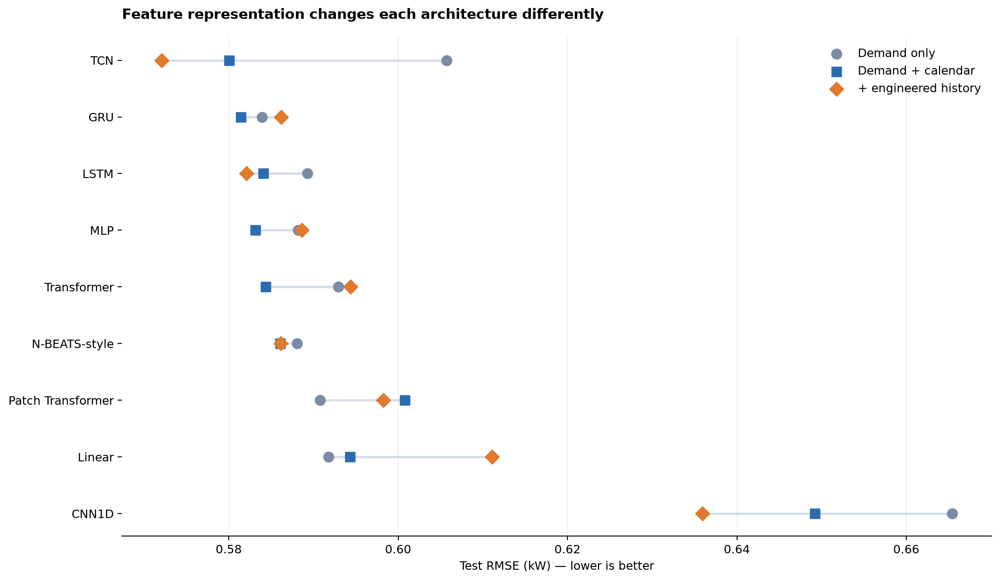
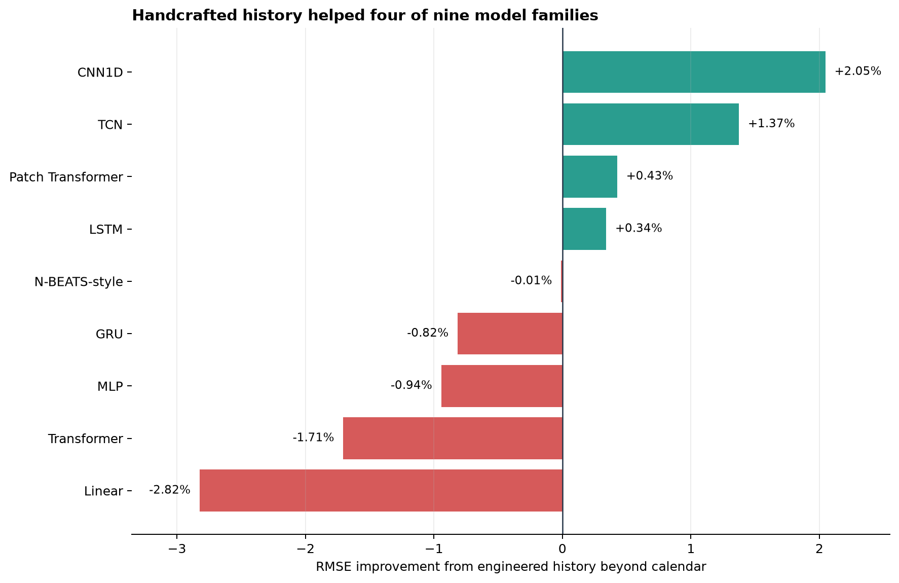
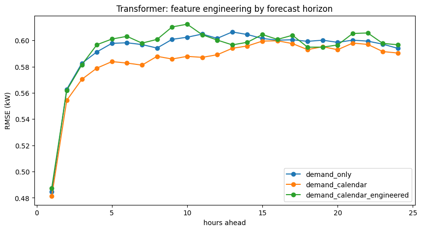
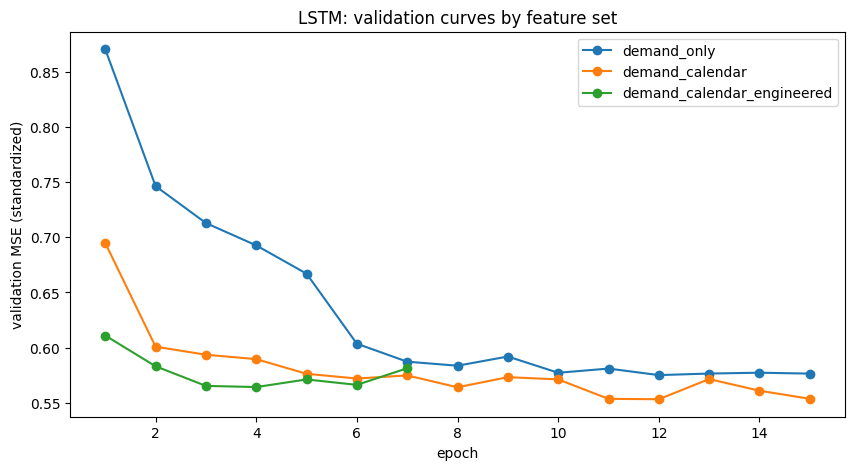

# Do Calendar and Lagged Features Help Sequence Models?

*When extra inputs add signal, supply a shortcut, or merely duplicate what the model already sees*

**Series:** Sequence Models for Prediction, Part 14 of 16
**Suggested Medium tags:** Feature Engineering, Time Series, Data Leakage, Forecasting, Python

Part 13 compared nine architectures using the same single input: one week of raw electricity demand. That isolated the model question.

Now we can change the representation.

A feature list looks harmless.

```python
FEATURE_SETS = {
    "demand_only": ["demand_z"],
    "demand_calendar": ["demand_z", *CALENDAR_COLS],
    "demand_calendar_engineered": [
        "demand_z",
        *ENGINEERED_HISTORY_COLS,
        *CALENDAR_COLS,
    ],
}
```

But in time-series work, every column is also a statement about information: what was known, when it was known, and how far into the past the model can reach.

This experiment contains three useful classes of feature.

## 1. The raw target history

`demand_z` is hourly electricity demand standardized with statistics from the training period:

```text
demand_z = (demand_kw - training_mean) / training_std
```

Computing the scaler on the training segment is essential. A mean or standard deviation calculated on the full dataset would let validation and test values influence preprocessing.

At a forecast origin `t`, the demand-only model receives:

```text
demand[t-168], ..., demand[t-1]
```

and predicts:

```text
demand[t], ..., demand[t+23]
```

That is the baseline information budget: 168 observed target values.

## 2. Calendar identity

Hour and weekday are circular variables. Treating hour as an integer creates an artificial cliff between 23 and 0, even though those hours are adjacent.

The usual encoding places each hour on a circle:

```python
hour_sin = np.sin(2 * np.pi * hour / 24)
hour_cos = np.cos(2 * np.pi * hour / 24)
```

Day of week receives the same treatment with a period of seven. A weekend flag adds a coarser behavioral distinction.

These features expose periodic position rather than a transformation of demand. They are also known in advance. In the notebook they accompany historical input steps, which helps anchor the sequence in the weekly cycle. A more complete multi-horizon model could additionally pass the 24 future timestamps as known future covariates.

That would be a separate experimental condition. Adding it silently would change the forecasting interface.

## 3. Engineered demand history

The engineered group contains ten channels:

```python
ENGINEERED_HISTORY_COLS = [
    "lag_24_z",
    "lag_168_z",
    "diff_1_z",
    "diff_24_z",
    "mean_24_z",
    "std_24_z",
    "mean_168_z",
    "std_168_z",
    "level_z_24",
    "level_z_168",
]
```

Each family encodes a different inductive hint.

### Lags: “compare this moment with a meaningful offset”

`lag_24_z` exposes the same hour yesterday. `lag_168_z` exposes the same hour one week ago.

Lags turn a potentially difficult memory problem into a local channel comparison. A model at input step `u` no longer has to travel 168 positions to compare `demand[u]` and `demand[u-168]`; both values sit in the feature vector at step `u`.

### Differences: “focus on movement, not just level”

`diff_1_z` measures the latest hourly movement. `diff_24_z` measures the change relative to yesterday at the same time.

Differences can make turning points easier to recognize, although they are algebraically redundant when both component values are available.

### Rolling moments: “summarize the local regime”

Daily and weekly rolling means describe level. Rolling standard deviations describe recent variability.

These summaries can be useful when a compact architecture struggles to aggregate many observations. They can also smooth away structure or create correlated input channels.

### Relative level: “how unusual is now?”

The final two fields compare current standardized demand with its rolling distribution:

```text
level_z_24  = (demand_z - mean_24_z)  / (std_24_z  + epsilon)
level_z_168 = (demand_z - mean_168_z) / (std_168_z + epsilon)
```

They provide a local anomaly score: not simply whether demand is high, but whether it is high relative to the recent day or week.

## Causal does not mean equal information

All of these features are constructed with backward-looking shifts and rolling windows. Nothing after the forecast origin is used. That makes them causal.

It does **not** mean that all three feature sets contain the same raw history.

Consider the `lag_168_z` channel. The engineered model still receives 168 feature rows, covering timestamps `t-168` through `t-1`. But the lag value attached to the first row is:

```text
lag_168 at t-168 = demand[t-336]
```

The final lag value is:

```text
lag_168 at t-1 = demand[t-169]
```

So that one channel exposes a second week of raw observations:

```text
demand-only raw reach:  t-168 ... t-1
engineered raw reach:   t-336 ... t-1
```

Weekly rolling statistics have a similar effect. The engineered model has a wider historical information budget, even though `X.shape[1]` remains 168.

This is not future leakage. Every value was available at prediction time. It is an ablation-design confound: the experiment changes both representation and historical reach.

## Three fair questions, not one

Once we see the distinction, the original question separates into three better experiments.

### Experiment A: Does more raw history help?

Give every model 336 raw hourly demand values, then compare it with a 168-row engineered representation that can reach the same oldest timestamp.

This measures whether manual compression is a useful way to package a larger context.

### Experiment B: Does engineering help under a fixed history budget?

Restrict every derived feature to the same 168 raw observations available to the demand-only model. Unavailable lag values near the beginning of the window must be masked, omitted, or summarized only at the forecast origin.

This is the cleanest test of representation engineering.

### Experiment C: Do known future timestamps help?

Pass the calendar fields for `t` through `t+23` through an explicit future-covariate path. Compare that with historical calendar fields only.

This measures the value of future-known information, not just a label attached to the past.

## Identical origins still matter

The notebook does something important correctly: it creates the richest feature frame first, waits for all lag and rolling columns to become valid, and then uses the same forecast origins for all variants.

Without that rule, a demand-only model could train on earlier dates that the engineered model cannot use. Seasonal coverage and sample counts would differ.

Fair time-series comparisons require more than an identical train/test percentage. They require identical prediction timestamps.

## A practical feature audit

Before adding any column to a forecasting model, ask:

1. Was this value observable before the forecast was issued?
2. Does its calculation use a statistic fitted outside the training data?
3. How far back does it reach in raw observations?
4. Does it add new information, re-express existing information, or both?
5. Will the feature be available in exactly the same way in production?
6. If it is known in the future, is the model actually given its future values?

That audit is more valuable than arguing abstractly about whether deep learning “needs” feature engineering.

## What happened in the electricity experiment?

The experiment evaluates three representations for every architecture:

1. **Demand only:** one raw-history channel.
2. **Demand plus calendar:** demand, cyclical hour, cyclical weekday, and a weekend flag—six channels in total.
3. **Demand plus calendar and engineered history:** the six previous channels plus ten lag, difference, rolling, and relative-level features—16 channels in total.

The forecast origins, target values, chronological split, and 24-hour objective remain identical. Only the model inputs change. Lower RMSE is better.



| Model | Demand only | + calendar | + calendar and engineered history | Change from engineering |
|---|---:|---:|---:|---:|
| CNN1D | 0.6654 | 0.6492 | **0.6359** | +2.05% |
| TCN | 0.6057 | 0.5800 | **0.5721** | +1.37% |
| Patch Transformer | **0.5908** | 0.6008 | 0.5982 | +0.43% |
| LSTM | 0.5893 | 0.5841 | **0.5821** | +0.34% |
| N-BEATS-style | 0.5881 | **0.5861** | 0.5861 | −0.01% |
| GRU | 0.5839 | **0.5814** | 0.5862 | −0.82% |
| MLP | 0.5882 | **0.5831** | 0.5886 | −0.94% |
| Transformer | 0.5929 | **0.5844** | 0.5944 | −1.71% |
| Linear | **0.5918** | 0.5943 | 0.6111 | −2.82% |

Bold identifies the best representation within each model family. The final column compares the full 16-channel representation with demand plus calendar. A positive percentage means the engineered demand-history features reduced error.

These are preliminary single-seed results. Small differences should be treated as hypotheses to reproduce, not fixed rankings.

## Calendar information helped most models

Adding historical calendar channels improved seven of the nine architectures. The largest absolute improvement belonged to the TCN, whose RMSE fell from 0.6057 to 0.5800 kW. The generic Transformer improved from 0.5929 to 0.5844, and the MLP improved from 0.5882 to 0.5831.

This makes intuitive sense. Raw demand contains daily and weekly repetition, but the model must infer the phase of those cycles from the values and their positions. Calendar encodings label that phase explicitly: this observation occurred at a particular hour and weekday.

The result is not universal. The linear model and simplified patch Transformer did slightly better with demand alone. One reason may be that a 168-hour window already spans exactly one week. Position inside the window therefore acts as a relative clock. Historical calendar variables add an absolute phase, but that phase is not guaranteed to improve generalization.

There is also an important limitation: the notebook supplies calendar fields for the **historical** 168 steps, not the 24 future targets. In production, the future hour and weekday are known. Passing them through an explicit future-covariate branch could be more valuable, but it would be a new experiment rather than a reinterpretation of this one.

## Engineered history helped four models—and hurt four

The richer feature set did not produce a general upgrade.

Compared with demand plus calendar:

- CNN1D improved by 2.05%;
- TCN improved by 1.37%;
- the simplified patch Transformer improved by 0.43%;
- LSTM improved by 0.34%;
- N-BEATS-style was effectively unchanged;
- GRU, MLP, Transformer, and linear forecasting became worse.



The largest positive changes occurred in the convolutional models. That pattern is more revealing than the overall best score.

The CNN1D sees local nine-hour patterns before global average pooling. Exact daily and weekly positions are difficult to retain through that bottleneck. Direct lag and rolling channels give it summaries that its original path handles awkwardly.

The tested TCN has a final receptive field of only 31 hours. Its raw-demand path cannot derive a weekly relationship from the beginning of a 168-hour input. A `lag_168` channel places week-old demand next to each recent input row, allowing a short-context convolution to use it immediately.

The full-feature TCN achieves the lowest score in the entire table: 0.5721 kW. But the right interpretation is precise:

> Explicit lag features helped this particular short-receptive-field TCN access long seasonal information.

The result does not show that a TCN designed with a receptive field covering the full week would need those lags.

## Why did flexible global models fail to benefit?

The GRU, MLP, linear model, and Transformer all became worse when the engineered history was added. N-BEATS-style was essentially unchanged.

Those architectures already have plausible direct routes to the complete raw week:

- the MLP and linear model flatten every input position;
- self-attention connects each token to all historical tokens;
- recurrent gates can carry information through the sequence;
- N-BEATS-style dense blocks operate on the complete flattened window.

Explicit differences and rolling statistics may therefore be redundant. Redundancy is not always harmless. It increases dimensionality, introduces strongly correlated columns, changes parameter counts, and can lead optimization toward patterns that fit the training period but transfer poorly.

The generic Transformer is a clear example. Calendar fields improved it by about 1.4%, but the engineered group erased that gain and pushed RMSE to 0.5944—slightly worse than demand alone.



The horizon curve matters because the aggregate score does not reveal *where* a representation helps. A model might improve the first few hours and lose accuracy around the following morning peak. A multi-step prediction should be evaluated as a path as well as a single number.

## Extra features also change model capacity

Moving from one input channel to 16 does not affect all architectures equally.

For a recurrent or convolutional model, most parameters live in hidden-to-hidden transformations or later layers, so the input expansion is relatively modest. For a model that flattens its input, the first dense layer becomes much larger.

In this notebook:

- the MLP grows from roughly 79,000 to 724,000 parameters;
- the N-BEATS-style network grows from roughly 673,000 to 4.55 million;
- the direct linear model grows from roughly 4,000 to 65,000.

The feature comparison is therefore operationally realistic—this is what happens if we add columns without redesigning the architecture—but it is not a parameter-matched scientific isolation of representation alone.

## These features are exactly where CatBoost may shine

Calendar fields, explicit lags, rolling moments, differences, and relative-level measures turn a temporal problem into a structured table. That is the native territory of gradient-boosted trees.

CatBoost can learn rules such as “weekday morning, demand above its weekly mean, and rising relative to yesterday” without first discovering all three concepts from a raw sequence. On small and medium datasets, that explicit representation plus reliable boosting optimization often competes with or beats much more complicated sequence architectures.

The notebook did not run that model, so this article makes no claim about what CatBoost’s electricity RMSE would be. The correct follow-up is to train it on the same forecast origins, use only causally available features, give it a comparable tuning budget, and report either one direct model per horizon or a clearly defined multi-output strategy.

If the boosted-tree benchmark wins, that is not bad news. It means the engineered representation captured the useful structure more efficiently than the tested end-to-end sequence learners.

## Training curves can change the story

The models share a maximum of 15 epochs and use early stopping. That creates a consistent procedure, but not necessarily an equal opportunity to converge.



Learning curves help distinguish several possibilities:

- richer inputs improve both optimization and generalization;
- richer inputs fit faster but overfit validation;
- the model simply needs a different learning rate or longer schedule;
- the apparent gain is small enough to be ordinary seed variation.

The CNN validation loss was still improving when it reached the epoch limit. Its feature gain may be meaningful, but the architecture should also be retrained with a credible convergence budget before comparing it confidently with the rest of the table.

## The useful conclusion is conditional

This electricity experiment does not support either extreme claim:

```text
deep models learn everything, so engineered features are useless
```

or:

```text
time-series models always need explicit lags and rolling statistics
```

It supports a more practical rule:

> Engineered features are most promising when they expose information that an architecture cannot reach easily, compress a context it handles poorly, or introduce genuinely future-known inputs. When a model already has a short path to the same evidence, extra transformations may be neutral or harmful.

Calendar features and lagged features should also remain conceptually separate. Calendar variables describe temporal identity and may be known into the future. Lags, differences, and rolling moments transform observed target history. They answer different questions and should be tested in different steps.

Part 15 develops a protocol for separating model capacity, receptive field, raw-history budget, representation, and training variance. Part 16 then applies that discipline to a much noisier one-minute financial-direction case study.

---

**Series navigation:** [Series index](README.md) · [Previous: Electricity model comparison](12-electricity-results-and-interpretation.md) · [Next: Trustworthy experiments](14-designing-a-trustworthy-experiment.md)
