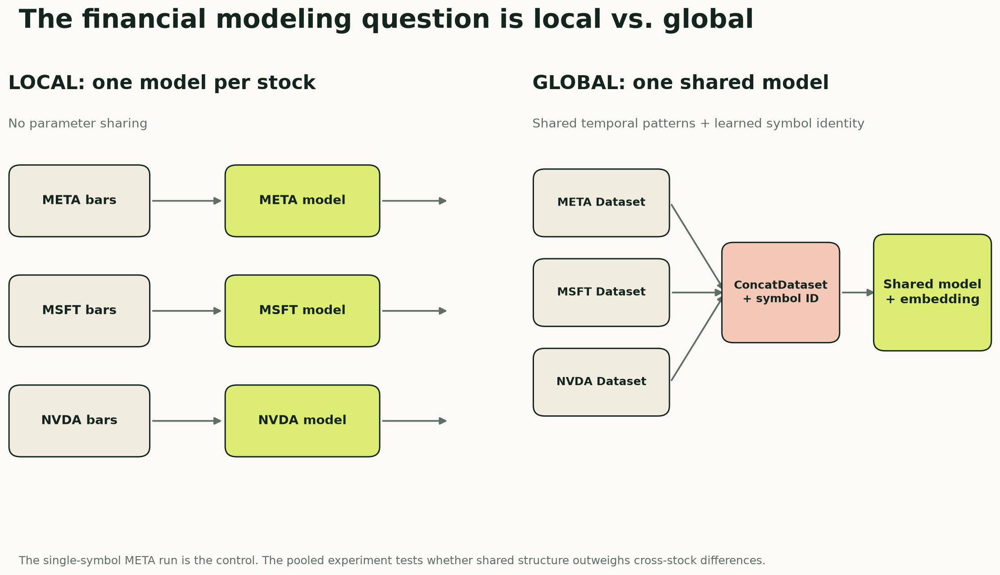

# One Model Per Stock or One Model for the Market?

*How per-symbol datasets, pooled training, and learned ticker embeddings change a financial sequence model*

**Series:** Sequence Models for Prediction, Part 16 of 16
**Suggested Medium tags:** Time Series, PyTorch, Quantitative Finance, Machine Learning, CatBoost

Suppose you have one-minute data for META, MSFT, NVDA, AMZN, and dozens of other stocks. Before choosing an LSTM, TCN, or Transformer, you face a more fundamental modeling decision:

> Should every stock get its own model, or should one global model learn across all stocks and receive the symbol as an input?

A local model can specialize in one stock’s behavior, but it throws away the training examples available in every other stock. A global model gains far more data and can learn reusable market patterns, but it also needs a way to distinguish META from MSFT. Otherwise it is asked to treat genuinely different processes as interchangeable.

This article develops that local-versus-global design. It shows how to build an independent sequence dataset for each ticker, combine those datasets without joining their timelines, carry a symbol ID through the `DataLoader`, and turn the ID into a learned embedding that any sequence architecture can use.

META is not the subject of the whole article. The saved notebook happened to execute with only META available, so that run is the **single-symbol control**. Its results show that the pipeline works in local mode. The more important next comparison is local models versus a pooled model across many symbols, with and without symbol identity.

> **Companion code:** [View the local-versus-global notebook on GitHub](https://github.com/adidror005/sequence-models-for-prediction/blob/main/notebooks/local_vs_global_stock_models.ipynb) · [Open it in Google Colab](https://colab.research.google.com/github/adidror005/sequence-models-for-prediction/blob/main/notebooks/local_vs_global_stock_models.ipynb) · [Read the data and setup notes](https://github.com/adidror005/sequence-models-for-prediction/tree/main/notebooks)



## The real experiment: local versus global learning

“Train on many stocks” is not one experimental condition. At least three versions are needed to learn what is actually helping:

| Condition | Training data | Symbol identity | Question answered |
|---|---|---|---|
| Local | One model per stock | Unnecessary | How well can a specialized model learn this ticker? |
| Pooled, symbol-blind | One model across all stocks | Omitted | Does additional cross-stock data help by itself? |
| Pooled, symbol-aware | One model across all stocks | Learned embedding | Does telling the model which stock it sees add value? |

The middle condition is essential. If the symbol-aware global model beats a local model, two things changed at once: it received more training examples and it received ticker identity. The symbol-blind pooled model separates those effects.

This is not ordinary feature engineering. It changes the statistical unit of the model. A local model estimates a different function for each ticker:

```text
prediction = f_META(sequence)
```

A global model estimates one shared function conditioned on identity:

```text
prediction = f(sequence, symbol)
```

The shared function can learn patterns such as intraday volume seasonality or short-term reversal once and reuse them. The symbol representation lets it adjust that shared behavior for each stock.

## Build one sequence Dataset per symbol

The safest design begins with a separate `Dataset` object for every ticker. Each object filters one symbol, sorts it chronologically, detects session or timestamp discontinuities, and creates endpoints only inside a continuous run.

```python
class SymbolSequenceDataset(Dataset):
    def __init__(self, frame, symbol, feature_cols, seq_len, symbol_to_id):
        one = (
            frame.loc[frame.symbol == symbol]
            .sort_values("date")
            .reset_index(drop=True)
        )
        self.symbol = symbol
        self.symbol_id = symbol_to_id[symbol]
        self.seq_len = seq_len

        self.X = torch.tensor(
            one[feature_cols].to_numpy(dtype="float32")
        )
        self.y = torch.tensor(
            one["label01"].to_numpy(dtype="float32")
        )

        dates = pd.to_datetime(one["date"])
        session_changed = one["session_date"].ne(one["session_date"].shift())
        minute_missing = dates.diff().ne(pd.Timedelta(minutes=1))
        self.run_id = (session_changed | minute_missing).cumsum().to_numpy()

        endpoints = []
        for run in np.unique(self.run_id):
            positions = np.flatnonzero(self.run_id == run)
            for end in positions[seq_len - 1:]:
                if torch.isfinite(self.y[end]):
                    endpoints.append(end)
        self.endpoints = np.asarray(endpoints)

    def __len__(self):
        return len(self.endpoints)

    def __getitem__(self, index):
        end = int(self.endpoints[index])
        start = end - self.seq_len + 1
        assert self.run_id[start] == self.run_id[end]
        return self.X[start:end + 1], self.y[end], self.symbol_id
```

The returned example contains three objects:

```text
sequence:  [78, 31]
label:     scalar
symbol_id: scalar integer category
```

Creating the per-symbol object first prevents the worst possible bug: a window ending with the final META bars and continuing with the first MSFT bars merely because both happened to be adjacent in a combined table.

The `run_id` check handles another boundary. A sequence cannot cross an overnight market closure or a missing minute and pretend the two observations are consecutive.

## Pool datasets, not ticker timelines

After each ticker has a safe dataset, PyTorch can expose them through one global index with `ConcatDataset`:

```python
symbols = ["META", "MSFT", "NVDA", "AMZN"]
symbol_to_id = {symbol: i for i, symbol in enumerate(symbols)}

train_ds = ConcatDataset([
    SymbolSequenceDataset(
        train_frame,
        symbol,
        FEATURE_COLS,
        seq_len=78,
        symbol_to_id=symbol_to_id,
    )
    for symbol in symbols
])

train_loader = DataLoader(
    train_ds,
    batch_size=512,
    shuffle=True,
)
```

Concatenation does not concatenate the raw time series. It concatenates the collections of valid examples. A batch may contain META, MSFT, and NVDA sequences, but every individual sequence was constructed entirely inside one symbol and one continuous trading session.

Shuffling the training loader is now safe because the examples were formed causally before batching. Validation and test loaders remain unshuffled so outputs are easy to align with their endpoints.

## A ticker is a category, not an ordinal number

The integer symbol ID should not enter the network as an ordinary numerical feature. An ID of `3` is not three times an ID of `1`, and adjacent IDs do not imply similar stocks.

Instead, use the ID to select a trainable embedding vector:

```python
class SymbolAwareClassifier(nn.Module):
    def __init__(self, temporal_model, num_symbols, embedding_dim=8):
        super().__init__()
        self.temporal_model = temporal_model
        self.symbol_embedding = nn.Embedding(
            num_embeddings=num_symbols,
            embedding_dim=embedding_dim,
        )

    def forward(self, sequence, symbol_id):
        # sequence: [batch, time, features]
        embedding = self.symbol_embedding(symbol_id)       # [batch, embed]
        embedding = embedding[:, None, :].expand(
            -1, sequence.size(1), -1
        )                                                  # [batch, time, embed]
        enriched = torch.cat([sequence, embedding], dim=-1)
        return self.temporal_model(enriched)
```

With 31 market features and an eight-dimensional symbol embedding, every time step becomes:

```text
[31 observed features | 8 learned symbol coordinates] = 39 inputs
```

The LSTM, GRU, CNN, TCN, or Transformer still processes time normally. It simply receives a small learned context vector telling it which stock generated the sequence.

The embedding is not automatically meaningful. It becomes useful only if the global objective discovers consistent differences between stocks. Those coordinates might encode liquidity, volatility, intraday behavior, or nothing interpretable at all. They are parameters optimized for prediction, not a ready-made map of company fundamentals.

## What can a shared model learn?

A global model is attractive because many market behaviors recur across assets:

- volume usually follows a strong intraday curve;
- volatility clusters;
- gaps, ranges, and short returns have comparable relative meanings;
- the open and close behave differently from midday;
- the same temporal filter can recognize a pattern in many liquid stocks.

Pooling lets all symbols contribute gradient updates to the shared encoder. That can regularize stocks with less data and make expensive architectures more practical.

But global learning can also fail. A high-volume technology stock, a bank, and an energy company do not have identical regimes or microstructure. Large symbols can dominate the loss simply because they provide more eligible sequences. A global model can also memorize symbol-specific history through the embedding instead of learning transferable patterns.

Useful controls include balanced sampling by ticker, reporting per-symbol metrics as well as a macro-average, and testing performance on symbols or time periods that were not favored during tuning.

## Design the comparison before reading the leaderboard

The local, symbol-blind pooled, and symbol-aware pooled runs should share:

- the same symbols and date-based train, validation, and test boundaries;
- the same target definition and movement-filtering rule;
- scalers fitted using training data only;
- identical sequence length and causal feature definitions;
- the same architecture, optimization budget, and seed set;
- both per-symbol metrics and an equal-weight macro-average.

If pooled training contains ten times more sequences, that is part of the hypothesis—not a nuisance to hide. Report it. A second comparison can control the number of sampled training examples to ask whether improvement comes from diversity or merely volume.

The strongest experiment matrix is:

| Run | Symbols | Shared encoder | Symbol embedding | Why it exists |
|---|---|---:|---:|---|
| A | META only | No | One constant ID in the saved run | Single-symbol pipeline control |
| B | Each ticker separately | No | No | Local-model benchmark |
| C | All tickers | Yes | No | Effect of pooled data |
| D | All tickers | Yes | Yes | Added value of symbol identity |

With only one ticker, the saved run’s embedding is constant across every example. It cannot represent differences between stocks, although it does add a small learned constant channel and extra parameters. The strict local benchmark in Run B should omit it. An optional fifth run holds the total number of training sequences fixed between B, C, and D, making the representation question cleaner.

## The saved control run: META alone

The notebook already contains the multi-symbol machinery above, but its recorded execution loaded only `META`. The numbers below are therefore evidence for Run A—the local control—not results of Runs B through D.

| Item | Saved experiment |
|---|---|
| Asset | META |
| Frequency | One-minute regular-trading-hours bars |
| Date range | January 2, 2013 to September 2, 2026 |
| Raw rows | 1,335,228 |
| Input | 78 consecutive one-minute bars |
| Features per bar | 31 |
| Target | Direction of the next one-minute close-to-close return |
| Split | Whole sessions: 75% train, 10% validation, 15% test |
| Selection metric | Validation ROC AUC |
| Random seed | 42 |

The final neural tensor has shape:

```text
[batch, 78 minutes, 31 features]
```

The CatBoost baseline uses the same eligible forecast endpoints and the same 31 engineered variables at the final endpoint, but it does not receive the full 78-step tensor. That difference matters: this is a comparison between sequence access and a strong tabular summary, not a claim that the representations are identical.

## Define the target before choosing the model

For a bar ending at time `t`, the next-minute return is:

```text
r[t → t+1] = Close[t+1] / Close[t] - 1
```

The underlying direction label is `+1` or `−1`; the binary classifier maps those values to `1` and `0`. Small changes are excluded rather than forcing nearly unchanged prices into an arbitrary up-or-down class.

The absolute-return cutoff is fitted on the training period only. In the saved META run it is the 35th percentile of the training absolute-return distribution:

```text
cutoff = 2.228412 basis points
```

Only moves whose magnitude exceeds that cutoff are labeled. This retains roughly two-thirds of otherwise eligible endpoints:

| Split | Retained | Positive share | Labeled endpoints |
|---|---:|---:|---:|
| Train | 65.00% | 50.24% | 545,415 |
| Validation | 68.21% | 50.54% | 76,378 |
| Test | 65.36% | 50.02% | 109,728 |

After requiring a continuous 78-bar window and an eligible label, the sequence datasets contain 404,273 training examples, 56,694 validation examples, and 80,598 test examples.

The nearly balanced positive shares are helpful. Plain accuracy would otherwise blur together ranking skill and class imbalance. ROC AUC asks whether a randomly selected positive example tends to receive a higher score than a randomly selected negative example. An AUC of `0.50` is chance; `1.00` is perfect ranking.

## Keep the time axis intact

Randomly splitting one-minute rows would leak market regimes and create near-duplicate windows on both sides of the boundary. This experiment instead assigns whole trading sessions chronologically:

```text
earliest sessions                            latest sessions
┌────────────── train 75% ──────────────┬─ val 10% ─┬─ test 15% ─┐
```

The target cutoff and neural scaling statistics are fitted only on training data. Windows must be continuous, so a sequence never jumps across an overnight gap and pretends that yesterday’s close is one minute before today’s open.

A minimal version of the alignment rule looks like this:

```python
import pandas as pd


def make_example(frame, end, lookback=78):
    start = end - lookback + 1
    window = frame.iloc[start : end + 1]

    assert len(window) == lookback
    assert window.index.to_series().diff().dropna().eq(pd.Timedelta(minutes=1)).all()

    x = window[FEATURE_COLS].to_numpy(dtype="float32")
    y = int(frame.iloc[end + 1].Close > frame.iloc[end].Close)
    return x, y
```

Production code also needs the session boundary, return-magnitude cutoff, missing-data, and eligibility checks. The important idea is that the last input is bar `t` and the target uses `t+1`—never the same row.

## What information did the models receive?

The 31 inputs combine short-horizon price action, intraday context, volume, and longer price memory.

### Twenty-five base features

The base representation includes:

- returns over 1, 2, 5, and 15 minutes;
- candle body, range, gap from the previous close, and close location inside the bar;
- rolling return means and standard deviations over 5, 15, 30, and 60 minutes;
- log volume, 30-minute volume z-score, and relative volume over 5 and 30 minutes;
- minute from the open plus sine and cosine time-of-day encodings;
- close relative to the bar’s average price, and average price relative to the session open.

These variables mostly describe the current intraday state. They tell the model whether the latest move is large, volatile, high-volume, extended inside the bar, or occurring at a particular time of day.

### Six price-memory features

The enhanced representation adds:

- close versus the previous day’s close;
- log distance from a 30-minute moving average;
- log distance from 1-, 5-, and 20-day moving averages;
- a one-day log-price z-score.

Raw log price is intentionally omitted. The representation asks about relative location rather than allowing the model to memorize META’s nominal price level. No fractional differencing was used.

Distribution-dependent neural inputs are scaled using training-only statistics. Naturally bounded or already relative variables keep their direct interpretation. The CatBoost baseline receives the unscaled engineered endpoints because trees do not need the same normalization.

## Six neural architectures, one training protocol

The experiment trains the model families already developed in this series:

| Model | Trainable parameters | How it reads the window |
|---|---:|---|
| MLP | 327,938 | Flattens all 78 bars into one vector |
| LSTM | 25,154 | Compresses the sequence through gated recurrent state |
| GRU | 18,882 | Uses a leaner gated recurrent state |
| CNN1D | 30,914 | Learns local temporal filters |
| TCN | 30,978 | Uses causal, dilated temporal convolutions |
| Transformer | 74,242 | Relates time positions through self-attention |

All six use AdamW, `0.20` dropout, `1e-3` weight decay, at most 20 epochs, and early stopping after two validation-AUC epochs without improvement.

Before the full run, two fail-fast tests passed:

1. a gradient and optimizer-step check confirmed that parameters actually changed;
2. a tiny real-data subset reached 100% training accuracy, showing that the model and loss could memorize when asked to.

These checks do not prove generalization. They eliminate quieter implementation failures that can make every architecture look equally mediocre.

## What happened in the META control


| Model | Validation AUC | Test AUC | Test balanced accuracy | Test probability SD |
|---|---:|---:|---:|---:|
| **CatBoost** | **0.530272** | **0.531812** | 0.520192 | 0.030451 |
| GRU | 0.525753 | 0.530355 | **0.521797** | 0.024802 |
| Transformer | 0.528783 | 0.530250 | 0.520478 | 0.027154 |
| TCN | 0.524231 | 0.529784 | 0.519835 | 0.025335 |
| LSTM | 0.526310 | 0.528563 | 0.518969 | 0.026953 |
| MLP | 0.514169 | 0.513493 | 0.509812 | 0.015184 |
| CNN1D | 0.511011 | 0.507748 | 0.506471 | 0.009829 |

These numbers are a pipeline check and a local-model baseline, not the main local-versus-global answer. Three observations are still useful.

First, **the retained META signal is small**. The best test AUC is about `0.532`, only `0.032` above chance. That establishes a reference point for the pooled experiment without turning the article into a story about one metric.

Second, **CatBoost narrowly wins the statistical comparison**. Its test AUC exceeds the best neural test score, GRU’s `0.530355`, by only `0.001457`. That is a difference of roughly fifteen ten-thousandths—not a chasm. Repeated seeds and additional time periods could change the order.

Third, **recurrent state and the better long-range encoders cluster together**. GRU, Transformer, TCN, and LSTM all land between `0.5286` and `0.5304`. The MLP and CNN1D lag, and their smaller prediction dispersion suggests that they produced less differentiated scores.

The saved control supports a modest conclusion:

> On this META split and seed, several sequence models extracted a small amount of next-minute ranking signal, but none established a compelling advantage over a well-tuned CatBoost endpoint baseline.

It does not tell us whether pooled training helps, whether symbol embeddings add value, or whether the ranking would survive on other stocks.

## Why the CatBoost result is such a useful reality check

CatBoost never sees the complete 78-by-31 sequence. It receives the same eligible endpoints represented by 31 causal features. Those summaries already expose returns, volatility, volume, intraday phase, bar geometry, and moving-average distances.

That changes the modeling burden:

- a sequence network must learn which positions and patterns matter across the window;
- CatBoost receives a compact state description and learns nonlinear thresholds and interactions directly;
- the neural models get richer temporal access, but they also face a harder optimization problem.

This is the same uncomfortable lesson raised earlier in the series: architectural sophistication must earn its cost. When domain features compress the useful history well, gradient boosting can be extremely difficult to beat.

The comparison is still not perfectly representation-controlled. A stricter follow-up would add at least two conditions:

1. CatBoost on lag-expanded snapshots that expose selected positions from the 78-bar window;
2. neural models on the endpoint summary alone.

That would separate “trees versus networks” from “summary features versus full sequence.”

## Did longer price memory help?

The notebook includes a controlled MLP ablation. The eligible rows, labels, windows, and training rules remain fixed. Only six price-memory features are added to the original 25.


| MLP representation | Validation AUC | Test AUC |
|---|---:|---:|
| 25 base features | **0.519222** | **0.519120** |
| Base + 6 price-memory features | 0.514169 | 0.513493 |
| Enhanced minus base | −0.005053 | −0.005627 |

For this MLP, more context made generalization worse.

That can happen for several reasons. The longer-horizon distances may be redundant with recent returns, unstable across regimes, or easy for a large flattened MLP to overfit. The model may also need different regularization or capacity after the input dimension changes.

What the result does **not** say is that price memory is useless. One model, one feature bundle, one symbol, and one seed cannot answer that general question. In fact, CatBoost assigned meaningful descriptive importance to some moving-average-distance features. The correct conclusion is narrower:

> Explicit 1-, 5-, and 20-day price-location features did not improve the tested MLP under this experiment’s training protocol.

The next ablation should repeat the base-versus-enhanced comparison for every architecture and across several seeds. Otherwise feature value and model compatibility remain entangled.

## What did CatBoost use?


The largest CatBoost importance belongs to `close_location`: where the close falls between the minute’s low and high. Short-horizon geometry, the two-minute return, the gap from the prior close, volume, and time of day also rank highly. Two price-memory features—the distances from the 20-day and 30-minute moving averages—appear in the top ten.

This ranking is descriptive, not causal. Correlated predictors can split credit, substitute for each other, or move in importance when another feature is removed. It tells us where the fitted tree ensemble found useful partitions; it does not prove that changing a feature would change the market outcome.

A follow-up should combine permutation importance on untouched periods with grouped ablations. For example, remove all time-of-day variables together, then all bar-geometry variables, then the complete price-memory group. That is more informative than interpreting one importance number in isolation.

## Prediction quality is not profit

The experiment stops at classification metrics. It does not specify or evaluate a trading rule.

To move from a score to an economic claim, we would still need:

- a probability threshold or position-sizing rule fixed before the final test;
- realistic bid-ask spread, fees, slippage, and latency;
- turnover, exposure, drawdown, and capacity diagnostics;
- calibration and stability across score buckets;
- repeated seeds and walk-forward time folds;
- multiple symbols selected without hindsight;
- comparison with “do nothing,” simple momentum/reversal rules, and cost-aware CatBoost baselines.

At a one-minute horizon, those omissions are decisive. A statistically better ranking can coexist with negative net returns if the errors occur on expensive trades or the edge is smaller than execution costs. It can also coexist with a usable strategy under a carefully chosen decision rule. The classification table alone cannot tell us which world we are in.

So the sad but useful fact is this:

> A model can be statistically above chance and still be practically worthless.

That sentence is not pessimism. It is the boundary between a machine-learning experiment and a trading claim.

## What changes from electricity to finance?

The two case studies now expose very different kinds of sequence structure.

| Question | Electricity demand | Multi-symbol financial design |
|---|---|---|
| Target | Next 24 demand values | Next-minute direction after excluding small moves |
| Dominant structure | Strong daily and weekly rhythm | Shared market behavior plus symbol-specific differences |
| Main modeling unit | One demand series | Local ticker models or one pooled symbol-aware model |
| Strong simple check | Naive seasonal forecasts; CatBoost as global benchmark | Per-symbol models, symbol-blind pooling, and CatBoost |
| Feature lesson | Calendar helped most models; engineered history varied by architecture | Symbol identity must be separated from the value of extra pooled data |
| Biggest interpretation risk | Unequal raw-history reach | Accidentally mixing symbols, sessions, or data-volume effects |

On electricity, the main sequence comes from one source. In finance, the definition of a training example also includes asset identity. More expressive models do not manufacture a universal market pattern; the global experiment must demonstrate that sharing parameters across symbols is actually useful.

## What I would run next

The saved notebook also defines an additional CatBoost technical-analysis feature set, but those cells have no recorded result. It would be misleading to include that variant in the leaderboard.

The next credible experiment should proceed in this order:

1. choose several liquid symbols and freeze common walk-forward date boundaries;
2. train one independent local model per symbol;
3. train one pooled model without any symbol input;
4. train the same pooled model with a learned symbol embedding;
5. report every ticker separately and use an equal-weight macro-average;
6. repeat all conditions across at least five seeds;
7. rerun the comparison with an equal number of sampled training sequences;
8. only then add feature ablations, technical indicators, and a cost-aware trading rule.

Only then should this become a claim about financial usefulness.

## The takeaway

The main lesson is not a META score. It is that moving from one stock to many changes the model’s data contract.

Build windows inside one ticker and one continuous session. Pool the finished datasets rather than raw timelines. Carry symbol identity as a categorical ID, convert it to a learned embedding, and compare that model with both local models and a symbol-blind pooled control.

Only that experiment can tell us whether a sequence architecture has learned reusable market behavior—or simply mixed more data into the same optimizer.

The [public companion notebook](https://github.com/adidror005/sequence-models-for-prediction/blob/main/notebooks/local_vs_global_stock_models.ipynb) contains the full per-symbol dataset and symbol-aware model machinery plus the saved META control. Bring your own licensed one-minute data and switch the experiment mode to run the pooled comparison; the repository intentionally does not redistribute market bars.

---

**Series navigation:** [Series index](README.md) · [Previous: Designing a trustworthy experiment](14-designing-a-trustworthy-experiment.md) · [Next application: Stock-prediction roadmap](future-stock-prediction-roadmap.md)
