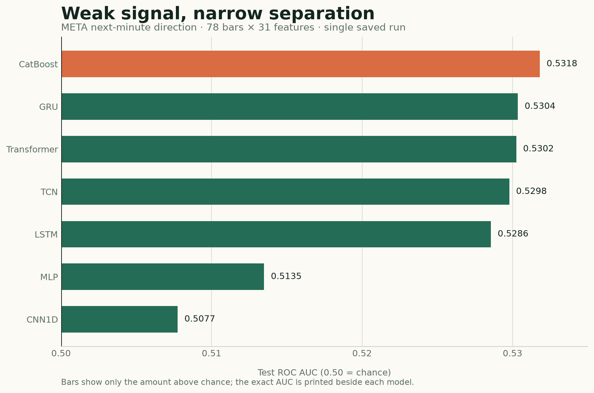
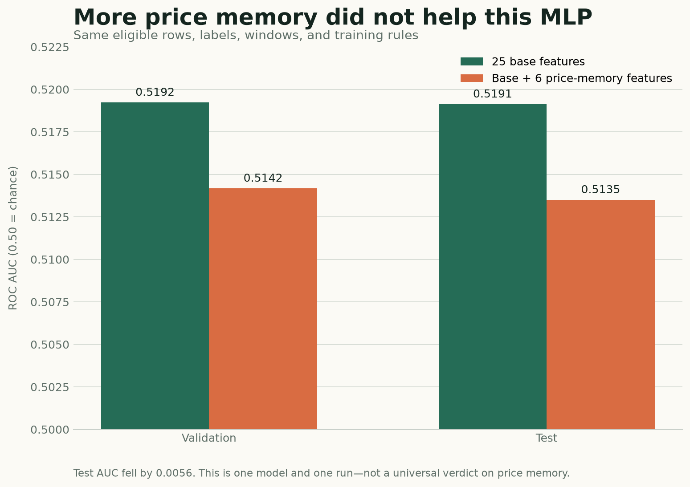
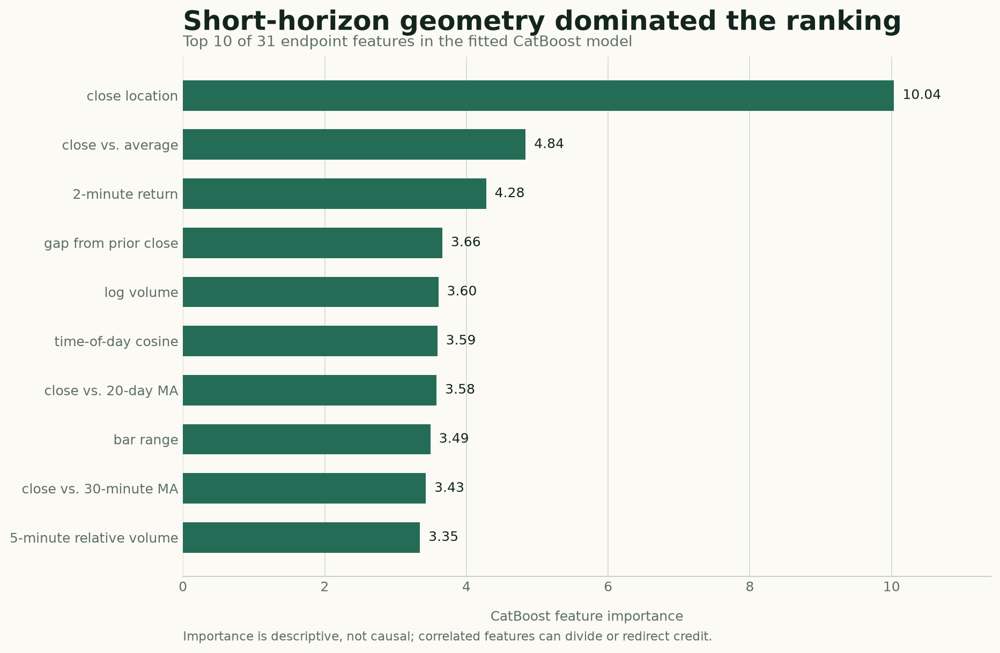

# When Sequence Models Meet Market Noise: A One-Minute META Case Study

*Six neural architectures, one CatBoost baseline, and the humbling difference between measurable signal and a tradable strategy*

**Series:** Sequence Models for Prediction, Part 16 of 16
**Suggested Medium tags:** Time Series, PyTorch, Quantitative Finance, Machine Learning, CatBoost

The electricity experiment gave our models a generous structural advantage: household demand contains recurring daily and weekly rhythms. Financial prices are less accommodating. Patterns are weaker, regimes move, and even a statistically detectable edge may disappear after costs.

This case study asks a narrower question than “Can deep learning beat the market?”

> Given the last 78 one-minute META bars, can a model rank the direction of the next close-to-close move better than chance?

Six neural architectures and one CatBoost baseline were evaluated on the saved output of a single experiment. The result is useful precisely because it is not dramatic: every model stayed close to chance, CatBoost narrowly led, and adding longer price-memory features made the tested MLP worse.

That is not a trading strategy. It is a careful classification result—and a useful stress test for the architectural ideas in this series.

> **Companion code:** [View the complete notebook on GitHub](https://github.com/adidror005/sequence-models-for-prediction/blob/main/notebooks/meta_minute_direction_case_study.ipynb) · [Open it in Google Colab](https://colab.research.google.com/github/adidror005/sequence-models-for-prediction/blob/main/notebooks/meta_minute_direction_case_study.ipynb) · [Read the data and setup notes](https://github.com/adidror005/sequence-models-for-prediction/tree/main/notebooks)

## What was actually run

The notebook was designed with multi-symbol scaffolding, but its recorded execution loaded only `META`. The evidence in this article is therefore a **single-symbol case study**, not a multi-asset benchmark.

| Item | Saved experiment |
|---|---|
| Asset | META |
| Frequency | One-minute regular-trading-hours bars |
| Date range | January 2, 2013 to September 2, 2026 |
| Raw rows | 1,335,228 |
| Input | 78 consecutive one-minute bars |
| Features per bar | 31 |
| Target | Direction of the next one-minute close-to-close return |
| Split | Whole sessions: 75% train, 10% validation, 15% test |
| Selection metric | Validation ROC AUC |
| Random seed | 42 |

The final neural tensor has shape:

```text
[batch, 78 minutes, 31 features]
```

The CatBoost baseline uses the same eligible forecast endpoints and the same 31 engineered variables at the final endpoint, but it does not receive the full 78-step tensor. That difference matters: this is a comparison between sequence access and a strong tabular summary, not a claim that the representations are identical.

## Define the target before choosing the model

For a bar ending at time `t`, the next-minute return is:

```text
r[t → t+1] = Close[t+1] / Close[t] - 1
```

The underlying direction label is `+1` or `−1`; the binary classifier maps those values to `1` and `0`. Small changes are excluded rather than forcing nearly unchanged prices into an arbitrary up-or-down class.

The absolute-return cutoff is fitted on the training period only. In the saved META run it is the 35th percentile of the training absolute-return distribution:

```text
cutoff = 2.228412 basis points
```

Only moves whose magnitude exceeds that cutoff are labeled. This retains roughly two-thirds of otherwise eligible endpoints:

| Split | Retained | Positive share | Labeled endpoints |
|---|---:|---:|---:|
| Train | 65.00% | 50.24% | 545,415 |
| Validation | 68.21% | 50.54% | 76,378 |
| Test | 65.36% | 50.02% | 109,728 |

After requiring a continuous 78-bar window and an eligible label, the sequence datasets contain 404,273 training examples, 56,694 validation examples, and 80,598 test examples.

The nearly balanced positive shares are helpful. Plain accuracy would otherwise blur together ranking skill and class imbalance. ROC AUC asks whether a randomly selected positive example tends to receive a higher score than a randomly selected negative example. An AUC of `0.50` is chance; `1.00` is perfect ranking.

## Keep the time axis intact

Randomly splitting one-minute rows would leak market regimes and create near-duplicate windows on both sides of the boundary. This experiment instead assigns whole trading sessions chronologically:

```text
earliest sessions                            latest sessions
┌────────────── train 75% ──────────────┬─ val 10% ─┬─ test 15% ─┐
```

The target cutoff and neural scaling statistics are fitted only on training data. Windows must be continuous, so a sequence never jumps across an overnight gap and pretends that yesterday’s close is one minute before today’s open.

A minimal version of the alignment rule looks like this:

```python
import pandas as pd


def make_example(frame, end, lookback=78):
    start = end - lookback + 1
    window = frame.iloc[start : end + 1]

    assert len(window) == lookback
    assert window.index.to_series().diff().dropna().eq(pd.Timedelta(minutes=1)).all()

    x = window[FEATURE_COLS].to_numpy(dtype="float32")
    y = int(frame.iloc[end + 1].Close > frame.iloc[end].Close)
    return x, y
```

Production code also needs the session boundary, return-magnitude cutoff, missing-data, and eligibility checks. The important idea is that the last input is bar `t` and the target uses `t+1`—never the same row.

## What information did the models receive?

The 31 inputs combine short-horizon price action, intraday context, volume, and longer price memory.

### Twenty-five base features

The base representation includes:

- returns over 1, 2, 5, and 15 minutes;
- candle body, range, gap from the previous close, and close location inside the bar;
- rolling return means and standard deviations over 5, 15, 30, and 60 minutes;
- log volume, 30-minute volume z-score, and relative volume over 5 and 30 minutes;
- minute from the open plus sine and cosine time-of-day encodings;
- close relative to the bar’s average price, and average price relative to the session open.

These variables mostly describe the current intraday state. They tell the model whether the latest move is large, volatile, high-volume, extended inside the bar, or occurring at a particular time of day.

### Six price-memory features

The enhanced representation adds:

- close versus the previous day’s close;
- log distance from a 30-minute moving average;
- log distance from 1-, 5-, and 20-day moving averages;
- a one-day log-price z-score.

Raw log price is intentionally omitted. The representation asks about relative location rather than allowing the model to memorize META’s nominal price level. No fractional differencing was used.

Distribution-dependent neural inputs are scaled using training-only statistics. Naturally bounded or already relative variables keep their direct interpretation. The CatBoost baseline receives the unscaled engineered endpoints because trees do not need the same normalization.

## Six neural architectures, one training protocol

The experiment trains the model families already developed in this series:

| Model | Trainable parameters | How it reads the window |
|---|---:|---|
| MLP | 327,938 | Flattens all 78 bars into one vector |
| LSTM | 25,154 | Compresses the sequence through gated recurrent state |
| GRU | 18,882 | Uses a leaner gated recurrent state |
| CNN1D | 30,914 | Learns local temporal filters |
| TCN | 30,978 | Uses causal, dilated temporal convolutions |
| Transformer | 74,242 | Relates time positions through self-attention |

All six use AdamW, `0.20` dropout, `1e-3` weight decay, at most 20 epochs, and early stopping after two validation-AUC epochs without improvement.

Before the full run, two fail-fast tests passed:

1. a gradient and optimizer-step check confirmed that parameters actually changed;
2. a tiny real-data subset reached 100% training accuracy, showing that the model and loss could memorize when asked to.

These checks do not prove generalization. They eliminate quieter implementation failures that can make every architecture look equally mediocre.

## The main result: everyone stayed near chance



| Model | Validation AUC | Test AUC | Test balanced accuracy | Test probability SD |
|---|---:|---:|---:|---:|
| **CatBoost** | **0.530272** | **0.531812** | 0.520192 | 0.030451 |
| GRU | 0.525753 | 0.530355 | **0.521797** | 0.024802 |
| Transformer | 0.528783 | 0.530250 | 0.520478 | 0.027154 |
| TCN | 0.524231 | 0.529784 | 0.519835 | 0.025335 |
| LSTM | 0.526310 | 0.528563 | 0.518969 | 0.026953 |
| MLP | 0.514169 | 0.513493 | 0.509812 | 0.015184 |
| CNN1D | 0.511011 | 0.507748 | 0.506471 | 0.009829 |

Three observations matter more than the exact ranking.

First, **the signal is weak**. The best test AUC is about `0.532`, only `0.032` above chance. Large sample size can make a small effect measurable, but it does not automatically make it economically useful.

Second, **CatBoost narrowly wins the statistical comparison**. Its test AUC exceeds the best neural test score, GRU’s `0.530355`, by only `0.001457`. That is a difference of roughly fifteen ten-thousandths—not a chasm. Repeated seeds and additional time periods could change the order.

Third, **recurrent state and the better long-range encoders cluster together**. GRU, Transformer, TCN, and LSTM all land between `0.5286` and `0.5304`. The MLP and CNN1D lag, and their smaller prediction dispersion suggests that they produced less differentiated scores.

The saved run therefore supports a modest conclusion:

> On this META split and seed, several sequence models extracted a small amount of next-minute ranking signal, but none established a compelling advantage over a well-tuned CatBoost endpoint baseline.

It does not support “Transformers work for trading,” “GRUs are best for stocks,” or “CatBoost always wins.”

## Why the CatBoost result is such a useful reality check

CatBoost never sees the complete 78-by-31 sequence. It receives the same eligible endpoints represented by 31 causal features. Those summaries already expose returns, volatility, volume, intraday phase, bar geometry, and moving-average distances.

That changes the modeling burden:

- a sequence network must learn which positions and patterns matter across the window;
- CatBoost receives a compact state description and learns nonlinear thresholds and interactions directly;
- the neural models get richer temporal access, but they also face a harder optimization problem.

This is the same uncomfortable lesson raised earlier in the series: architectural sophistication must earn its cost. When domain features compress the useful history well, gradient boosting can be extremely difficult to beat.

The comparison is still not perfectly representation-controlled. A stricter follow-up would add at least two conditions:

1. CatBoost on lag-expanded snapshots that expose selected positions from the 78-bar window;
2. neural models on the endpoint summary alone.

That would separate “trees versus networks” from “summary features versus full sequence.”

## Did longer price memory help?

The notebook includes a controlled MLP ablation. The eligible rows, labels, windows, and training rules remain fixed. Only six price-memory features are added to the original 25.



| MLP representation | Validation AUC | Test AUC |
|---|---:|---:|
| 25 base features | **0.519222** | **0.519120** |
| Base + 6 price-memory features | 0.514169 | 0.513493 |
| Enhanced minus base | −0.005053 | −0.005627 |

For this MLP, more context made generalization worse.

That can happen for several reasons. The longer-horizon distances may be redundant with recent returns, unstable across regimes, or easy for a large flattened MLP to overfit. The model may also need different regularization or capacity after the input dimension changes.

What the result does **not** say is that price memory is useless. One model, one feature bundle, one symbol, and one seed cannot answer that general question. In fact, CatBoost assigned meaningful descriptive importance to some moving-average-distance features. The correct conclusion is narrower:

> Explicit 1-, 5-, and 20-day price-location features did not improve the tested MLP under this experiment’s training protocol.

The next ablation should repeat the base-versus-enhanced comparison for every architecture and across several seeds. Otherwise feature value and model compatibility remain entangled.

## What did CatBoost use?



The largest CatBoost importance belongs to `close_location`: where the close falls between the minute’s low and high. Short-horizon geometry, the two-minute return, the gap from the prior close, volume, and time of day also rank highly. Two price-memory features—the distances from the 20-day and 30-minute moving averages—appear in the top ten.

This ranking is descriptive, not causal. Correlated predictors can split credit, substitute for each other, or move in importance when another feature is removed. It tells us where the fitted tree ensemble found useful partitions; it does not prove that changing a feature would change the market outcome.

A follow-up should combine permutation importance on untouched periods with grouped ablations. For example, remove all time-of-day variables together, then all bar-geometry variables, then the complete price-memory group. That is more informative than interpreting one importance number in isolation.

## AUC is not profit

The experiment stops at classification metrics. It does not specify or evaluate a trading rule.

To move from a score to an economic claim, we would still need:

- a probability threshold or position-sizing rule fixed before the final test;
- realistic bid-ask spread, fees, slippage, and latency;
- turnover, exposure, drawdown, and capacity diagnostics;
- calibration and stability across score buckets;
- repeated seeds and walk-forward time folds;
- multiple symbols selected without hindsight;
- comparison with “do nothing,” simple momentum/reversal rules, and cost-aware CatBoost baselines.

At a one-minute horizon, those omissions are decisive. A test AUC near `0.53` can coexist with negative net returns if the errors occur on expensive trades or the edge is smaller than execution costs. It can also coexist with a usable strategy under a carefully chosen decision rule. The classification table alone cannot tell us which world we are in.

So the sad but useful fact is this:

> A model can be statistically above chance and still be practically worthless.

That sentence is not pessimism. It is the boundary between a machine-learning experiment and a trading claim.

## What changes from electricity to finance?

The two case studies now expose very different kinds of sequence structure.

| Question | Electricity demand | META one-minute direction |
|---|---|---|
| Target | Next 24 demand values | Next-minute direction after excluding small moves |
| Dominant structure | Strong daily and weekly rhythm | Weak, shifting short-horizon dependencies |
| Main metric | Forecast RMSE | ROC AUC and balanced accuracy |
| Strong simple check | Naive seasonal forecasts; CatBoost as global benchmark | CatBoost on causal endpoint features |
| Feature lesson | Calendar helped most models; engineered history varied by architecture | Added price memory hurt the tested MLP |
| Biggest interpretation risk | Unequal raw-history reach | Confusing statistical ranking with tradable profit |

On electricity, inductive bias helps organize recurring structure. On intraday prices, there may be much less stable structure to organize. More expressive models do not manufacture predictability; they only create more ways to represent what the data actually contains.

## What I would run next

The saved notebook also defines an additional CatBoost technical-analysis feature set, but those cells have no recorded result. It would be misleading to include that variant in the leaderboard.

The next credible experiment should proceed in this order:

1. rerun the neural and CatBoost comparisons across at least five seeds;
2. use walk-forward periods rather than one final chronological split;
3. run the 25-versus-31-feature ablation for every model family;
4. add several liquid symbols and report both per-symbol and macro-average results;
5. test the defined technical-analysis feature group as a predeclared CatBoost ablation;
6. calibrate scores and declare a trading rule before viewing its final economic test;
7. deduct spread, fees, slippage, and a latency assumption;
8. report confidence intervals, turnover, drawdown, and sensitivity to thresholds and costs.

Only then should this become a claim about financial usefulness.

## The takeaway

This is exactly the kind of result a practical sequence-model series needs.

GRU, Transformer, TCN, and LSTM found similar, weak next-minute ranking signal. CatBoost extracted slightly more from a compact endpoint representation. Extra price-memory variables hurt the tested MLP. None of those facts establishes a profitable strategy.

The most general lesson is not which model sits at the top of a third decimal place. It is how to reason when the leaderboard is compressed:

- verify alignment and optimization before interpreting failure;
- keep the chronological contract strict;
- compare architectures with strong tabular baselines;
- ablate feature groups instead of admiring feature importance;
- repeat across seeds, periods, and assets;
- keep statistical prediction separate from economic value.

In noisy domains, humility is not a disclaimer added after the result. It is part of the modeling method.

The [public companion notebook](https://github.com/adidror005/sequence-models-for-prediction/blob/main/notebooks/meta_minute_direction_case_study.ipynb) contains the complete saved experiment through the reported CatBoost comparison. Bring your own licensed one-minute data; the repository intentionally does not redistribute market bars.

---

**Series navigation:** [Series index](README.md) · [Previous: Designing a trustworthy experiment](14-designing-a-trustworthy-experiment.md) · [Next application: Stock-prediction roadmap](future-stock-prediction-roadmap.md)
