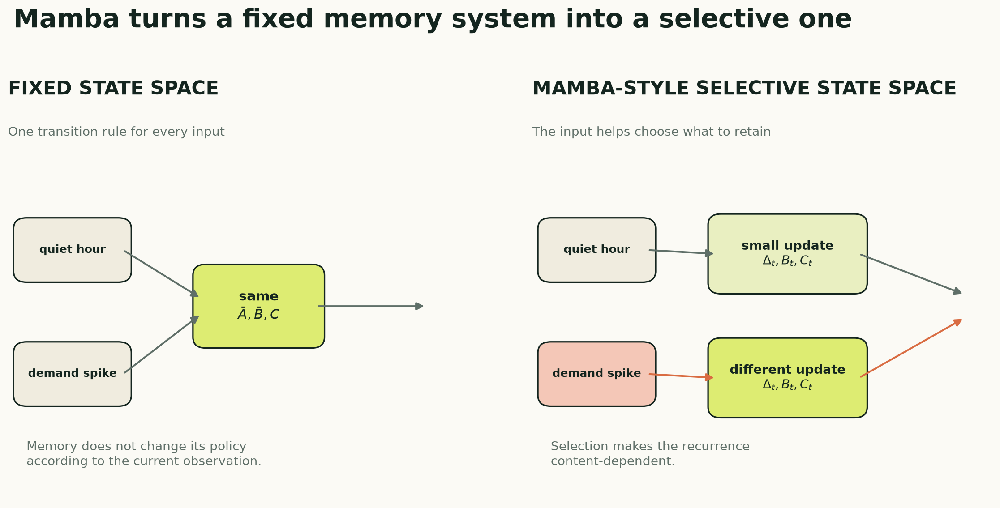

# Mamba for Time-Series Forecasting: Selective State-Space Memory

*How input-dependent dynamics decide what to retain—and a complete educational Mamba-style forecaster in PyTorch*

**Series:** Sequence Models for Prediction, Part 13 of 18
**Suggested Medium tags:** Mamba, State Space Models, Time Series, PyTorch, Deep Learning

A conventional state-space model carries history in a compact latent state. It can remember for a long time without comparing every pair of timestamps.

But its memory rule is fixed. The same dynamics process a quiet hour, a holiday transition, a sensor failure, and a demand spike.

Mamba changes that.

> The current input helps decide what the model writes, what it keeps, and what it reads from the state.

This is **selectivity**. It gives a state-space recurrence some of the content-dependent behavior that makes attention powerful, while retaining a recurrent computation whose work grows linearly with sequence length.



## The problem with fixed memory

The discrete state-space recurrence from Part 12 is:

```text
h_t = A_bar h_(t-1) + B_bar u_t
y_t = C h_t + D u_t
```

The parameters are shared across the entire sequence. This time invariance is efficient and mathematically convenient, but it means the model cannot change its state-update policy based on the current observation.

Imagine a stream containing thousands of routine values and a few meaningful events. A fixed state-space system can learn several decay scales, but it cannot explicitly say, “this observation changes the situation; preserve it,” while treating nearby routine values differently.

Attention handles content-dependent retrieval by comparing tokens. Mamba instead makes parts of the recurrence depend on the input.

## What becomes selective?

In a simplified selective state-space layer, the current representation `u_t` generates:

```text
delta_t = softplus(W_delta u_t)
B_t     = W_B u_t
C_t     = W_C u_t
```

These quantities have intuitive roles:

- `delta_t` changes the effective amount of state evolution and forgetting;
- `B_t` changes how the current input writes into the state;
- `C_t` changes how the current state is read.

The underlying continuous transition `A` remains learned and stable. Its discretized value now varies with the current input:

```text
A_bar_t = exp(delta_t A)
B_bar_t = ((exp(delta_t A) - 1) / A) B_t

h_t = A_bar_t h_(t-1) + B_bar_t u_t
y_t = C_t h_t + D u_t
```

Large `delta_t` produces more decay in modes where `A` is negative. Small `delta_t` leaves more of the previous state intact. Together with `B_t` and `C_t`, the model can choose a different memory behavior at every step.

“Selective” does not mean a human-readable binary switch. These are learned continuous functions. The model may use them in ways that do not map neatly onto our story of important and unimportant events.

## Why not just use an LSTM?

An LSTM is also input-dependent. Its forget, input, and output gates change at every step.

The difference is architectural, not magical. Mamba belongs to the modern structured state-space line: it combines state-space dynamics, an input-dependent selective scan, local convolution, multiplicative gating, residual connections, and hardware-aware implementations designed for high sequence throughput.

The comparison is therefore:

| Model | Memory mechanism | Content-dependent? | Pairwise token interactions? |
|---|---|---:|---:|
| Fixed SSM | Structured linear state | No | No |
| LSTM/GRU | Nonlinear gated hidden state | Yes | No |
| Transformer | Attention over stored token representations | Yes | Yes |
| Mamba | Selective structured state | Yes | No |

Mamba does not make recurrent reasoning new. Its contribution is a particular route to content-dependent state-space modeling plus an implementation strategy that makes the selective recurrence efficient on modern hardware.

## The surrounding Mamba-style block

The selective scan is the conceptual center, but it is not the entire block. A compact Mamba-style block contains:

1. **Layer normalization** before the transformation.
2. **Input projection** into a content branch and a gate branch.
3. **Depthwise causal convolution** to mix nearby time steps.
4. **Selective state-space scan** for recurrent memory.
5. **Multiplicative gate** to control the transformed output.
6. **Output projection and residual connection** back to `d_model`.

The local convolution and state-space scan solve different problems. The convolution extracts short local patterns. The state carries information across the sequence. The gate modulates what the block sends onward.

The original Mamba architecture uses carefully designed projections and fused kernels. The implementation below preserves the conceptual pieces in ordinary PyTorch so the data flow is visible.

## Tensor shapes

The forecaster still accepts the shared series interface:

```text
x: [batch, lookback, n_features]
```

The first projection creates `d_model` channels. Inside a block, expansion creates `d_inner = expansion * d_model` channels:

```text
[batch, lookback, d_model]
    -> [batch, lookback, 2 * d_inner]
    -> content branch + gate branch
```

The selective state has shape:

```text
[batch, d_inner, d_state]
```

Notice that this state does not grow with `lookback`. The recurrence compresses the past into fixed-size memory. That is fundamentally different from full self-attention, which retains a representation for each token and forms a pairwise attention matrix during training.

After one or more residual blocks, the final time-step representation maps directly to the horizon:

```text
[batch, d_model] -> [batch, horizon]
```

## Complete educational PyTorch implementation

This implementation is intentionally self-contained. It is suitable for learning, testing shapes, and small experiments.

```python
import torch
from torch import nn


class SelectiveSSMLayer(nn.Module):
    """A clarity-first selective state-space scan."""

    def __init__(self, d_model, d_state=16):
        super().__init__()

        rates = torch.logspace(
            -1, 1, d_state, dtype=torch.float32
        )
        self.A_log = nn.Parameter(
            rates.log().repeat(d_model, 1)
        )

        self.delta_projection = nn.Linear(
            d_model, d_model
        )
        nn.init.normal_(
            self.delta_projection.weight, std=0.02
        )
        nn.init.constant_(
            self.delta_projection.bias, -3.0
        )
        self.B_projection = nn.Linear(
            d_model, d_state
        )
        self.C_projection = nn.Linear(
            d_model, d_state
        )
        self.D = nn.Parameter(torch.ones(d_model))

    def forward(self, u):
        batch, length, d_model = u.shape
        d_state = self.A_log.size(1)
        state = u.new_zeros(
            batch, d_model, d_state
        )

        # Stable continuous dynamics.
        A = -torch.exp(self.A_log)
        outputs = []

        for step in range(length):
            input_t = u[:, step, :]

            # The current input selects how the state
            # evolves, what is written, and what is read.
            delta_t = torch.nn.functional.softplus(
                self.delta_projection(input_t)
            )
            B_t = self.B_projection(input_t)
            C_t = self.C_projection(input_t)

            A_bar = torch.exp(
                delta_t.unsqueeze(-1)
                * A.unsqueeze(0)
            )
            B_bar = (
                (A_bar - 1.0)
                / A.unsqueeze(0)
            )
            B_bar = B_bar * B_t.unsqueeze(1)

            state = (
                A_bar * state
                + B_bar * input_t.unsqueeze(-1)
            )
            output_t = (
                state * C_t.unsqueeze(1)
            ).sum(dim=-1)
            output_t = output_t + self.D * input_t
            outputs.append(output_t)

        return torch.stack(outputs, dim=1)


class MambaBlock(nn.Module):
    def __init__(
        self,
        d_model,
        d_state=16,
        expansion=2,
        conv_kernel=4,
        dropout=0.10,
    ):
        super().__init__()
        d_inner = expansion * d_model

        self.norm = nn.LayerNorm(d_model)
        self.input_projection = nn.Linear(
            d_model, 2 * d_inner
        )

        # Depthwise convolution: each expanded channel
        # gets its own short local filter.
        self.depthwise_conv = nn.Conv1d(
            d_inner,
            d_inner,
            kernel_size=conv_kernel,
            padding=conv_kernel - 1,
            groups=d_inner,
        )

        self.ssm = SelectiveSSMLayer(
            d_inner, d_state=d_state
        )
        self.output_projection = nn.Linear(
            d_inner, d_model
        )
        self.dropout = nn.Dropout(dropout)

    def forward(self, x):
        residual = x

        content, gate = self.input_projection(
            self.norm(x)
        ).chunk(2, dim=-1)

        # Conv1d expects [batch, channels, time].
        length = content.size(1)
        content = self.depthwise_conv(
            content.transpose(1, 2)
        )

        # Right-crop the padded output so position t
        # never receives information from the future.
        content = content[:, :, :length]
        content = content.transpose(1, 2)
        content = torch.nn.functional.silu(content)

        content = self.ssm(content)
        content = (
            content
            * torch.nn.functional.silu(gate)
        )
        content = self.output_projection(content)

        return residual + self.dropout(content)


class MambaStyleForecaster(nn.Module):
    def __init__(
        self,
        n_features,
        horizon,
        d_model=64,
        d_state=16,
        n_blocks=2,
        expansion=2,
        conv_kernel=4,
        dropout=0.10,
    ):
        super().__init__()
        self.input_projection = nn.Linear(
            n_features, d_model
        )
        self.blocks = nn.ModuleList([
            MambaBlock(
                d_model=d_model,
                d_state=d_state,
                expansion=expansion,
                conv_kernel=conv_kernel,
                dropout=dropout,
            )
            for _ in range(n_blocks)
        ])
        self.norm = nn.LayerNorm(d_model)
        self.head = nn.Linear(d_model, horizon)

    def forward(self, x):
        sequence = self.input_projection(x)

        for block in self.blocks:
            sequence = block(sequence)

        final_state = self.norm(
            sequence[:, -1, :]
        )
        return self.head(final_state)


LOOKBACK = 168
N_FEATURES = 1
HORIZON = 24

model = MambaStyleForecaster(
    n_features=N_FEATURES,
    horizon=HORIZON,
    d_model=64,
    d_state=16,
    n_blocks=2,
)

x = torch.randn(32, LOOKBACK, N_FEATURES)
y_hat = model(x)

assert y_hat.shape == (32, HORIZON)

loss = y_hat.square().mean()
loss.backward()
assert all(
    parameter.grad is not None
    for parameter in model.parameters()
)
```

The same code is available in the [companion model module](code/sequence_models.py). The [shared PyTorch training companion](pytorch-data-pipeline-and-training-loop.md) supplies the chronological windows, `Dataset`, `DataLoader`, training loop, early stopping, and evaluation code.

## The honest label: Mamba-style, not optimized Mamba

This code demonstrates the key ideas:

- stable state-space dynamics;
- input-dependent `delta_t`, `B_t`, and `C_t`;
- a causal depthwise convolution;
- a gated branch;
- residual Mamba-style blocks;
- linear recurrent work in the number of time steps.

It does **not** reproduce the official fused selective-scan kernel, projection layout, initialization scheme, or every implementation detail. Its Python loop will be much slower than an optimized kernel, especially on a GPU. It should not be used to make speed or accuracy claims about the official architecture.

That distinction matters. “I wrote a selective recurrence inspired by Mamba” and “I benchmarked Mamba” are not the same statement.

## Using the official implementation

For a real Mamba benchmark, use the maintained [`state-spaces/mamba` package](https://github.com/state-spaces/mamba) and follow its current installation requirements. The original Mamba block keeps the sequence shape unchanged:

```python
import torch
from mamba_ssm import Mamba

batch = 32
length = 168
d_model = 64
device = "cuda"

layer = Mamba(
    d_model=d_model,
    d_state=16,
    d_conv=4,
    expand=2,
).to(device)

x = torch.randn(
    batch, length, d_model, device=device
)
y = layer(x)
assert y.shape == x.shape
```

A forecasting model still needs an input projection and a horizon head around that block. It also needs the same chronological validation protocol as every other model. A faster kernel does not remove leakage, insufficient data, or a poorly defined target.

The official repository now covers later members of the Mamba family as well. This article stays with the original selective-SSM idea because it is the conceptual step that belongs in this series.

## Complexity: linear is not automatically fast

Full self-attention forms pairwise interactions among `L` tokens, so its attention work and memory grow roughly with `L²`. A recurrent selective scan processes `L` updates, so its sequence scaling is linear.

That asymptotic advantage matters for long sequences. It does not guarantee that every Mamba implementation is faster at every length.

Real speed depends on:

- kernel fusion and memory movement;
- sequence length and batch size;
- channel and state dimensions;
- hardware;
- whether the implementation executes a Python loop;
- the cost of surrounding projections and convolutions.

For a 168-hour electricity window, quadratic attention may be perfectly manageable. Mamba's strongest computational case appears when sequences become much longer. At short lengths, choose from measured validation quality and end-to-end latency—not big-O notation alone.

## Time-series-specific design questions

Mamba does not decide the forecasting interface for us.

### How should the future be produced?

The tutorial uses the final representation to predict all horizons directly. Alternatives include an autoregressive decoder, horizon queries, or future-known covariates supplied to a separate head.

### Are the channels tokens or features?

Here, one timestamp is one token and all variables at that time form its feature vector. Other designs process channels independently or mix variables in separate blocks. This choice matters for multivariate forecasting.

### What happens at missing timestamps?

A recurrence assumes an ordered sequence. If the sampling interval changes, the model should receive a time-gap feature or use a discretization that explicitly incorporates elapsed time. Silently treating a three-hour gap as one hourly step changes the dynamics.

### Does the final state preserve exact seasonal position?

A fixed-size state can compress long context efficiently, but compression can discard details. Explicit calendar covariates, seasonal lags, skip connections, or pooling across outputs may still help. That remains an empirical question for the later feature-ablation article.

## Strengths

A Mamba-style forecaster offers:

- content-dependent recurrent memory;
- linear sequence scaling in the scan;
- a fixed-size state for streaming;
- local pattern extraction through causal convolution;
- no need to construct a pairwise attention matrix;
- a natural route to much longer contexts.

It is compelling when context is long, useful events are sparse or content-dependent, and recurrent deployment is attractive.

## Limitations and common failure modes

Mamba is more complex than a GRU, TCN, or fixed SSM. That complexity creates more places for an implementation or experiment to go wrong.

Watch for:

- a slow Python scan mistaken for optimized Mamba performance;
- noncausal convolutional padding that leaks future steps;
- numerical problems from unconstrained dynamics;
- excessive state or channel width on a small dataset;
- a final-state bottleneck that hides useful intermediate outputs;
- confusing long theoretical context with demonstrably useful context;
- benchmarking a simplified Mamba-style block under the official name.

Selective parameters also complicate interpretation. The state is content-dependent, but it is not an attention map. Inspecting `delta_t` alone does not tell the full story because writing and reading also depend on `B_t` and `C_t`.

## When to choose Mamba

Choose Mamba when sequences are long enough that attention cost matters, content-dependent retention is plausible, and you can use a tested optimized implementation.

For ordinary forecasting windows, compare it against a GRU, a deliberately sized TCN, a Transformer, and a fixed state-space model. Match parameter counts where possible. Report both predictive accuracy and measured throughput.

Most importantly, do not assume that a newer sequence architecture fixes a weak experiment. The target, data volume, split design, baselines, and information available at the forecast origin still dominate the credibility of the result.

Part 14 compares all eleven model families by memory, access pattern, computation, and practical use. The electricity leaderboard that follows remains the original nine-model experiment; state-space and Mamba results will be added only after they are run under the same protocol.

## Further reading

- [Gu and Dao, “Mamba: Linear-Time Sequence Modeling with Selective State Spaces”](https://arxiv.org/abs/2312.00752)
- [Official state-spaces/mamba implementation](https://github.com/state-spaces/mamba)
- [Gu, Goel, and Ré, “Efficiently Modeling Long Sequences with Structured State Spaces” (S4)](https://arxiv.org/abs/2111.00396)

---

**Series navigation:** [Series index](README.md) · [Previous: State-space models](state-space-models-for-forecasting.md) · [Next: Choosing a model](11-choosing-a-sequence-model.md)
