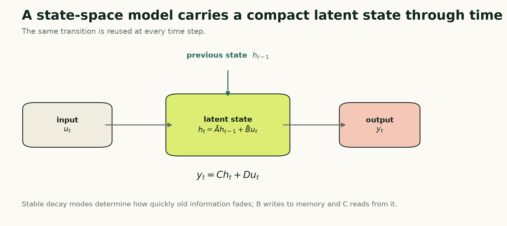

# State-Space Models for Forecasting: A Learnable Dynamical System

*Stable latent dynamics, long memory, and a complete diagonal state-space forecaster in PyTorch*

**Series:** Sequence Models for Prediction, Part 12 of 18
**Suggested Medium tags:** State Space Models, Time Series, Forecasting, PyTorch, Deep Learning

A recurrent neural network asks a learned nonlinear function to update its hidden state at every time step. A state-space model starts from a more structured question:

> Can the observed sequence be explained by a compact hidden dynamical system that evolves through time?

The hidden state might represent unobserved demand level, momentum, seasonal phase, equipment condition, or simply whatever compressed memory helps prediction. Each new observation writes into that state. The state evolves. A readout turns it into an output.

This is an old and powerful idea. What is new in modern sequence modeling is the scale and parameterization: structured state-space models make these dynamics trainable inside deep networks and useful for long sequences.



## The four pieces of a state-space model

A continuous-time linear state-space model is commonly written as:

```text
dh(t) / dt = A h(t) + B u(t)
y(t)      = C h(t) + D u(t)
```

The symbols have distinct jobs:

- `u(t)` is the observed input at time `t`;
- `h(t)` is the latent state—the model's memory;
- `A` controls how that memory evolves on its own;
- `B` controls how the current input writes into memory;
- `C` controls how memory is read;
- `D` is a direct path from the current input to the output.

For sampled time series, we need a discrete recurrence:

```text
h_t = A_bar h_(t-1) + B_bar u_t
y_t = C h_t + D u_t
```

That looks like a recurrent network, because it is recurrent. The crucial distinction is the structure of the transition. A basic state-space layer uses linear dynamics with parameters shared across time. An LSTM or GRU learns a nonlinear gated update whose gates change with each input.

The state-space restriction is not merely a limitation. It is an inductive bias: assume that useful memory can be represented as a mixture of stable dynamical modes.

## Decay modes are learnable memory scales

Suppose one component of the state follows:

```text
h_t = a h_(t-1) + b u_t
```

If `a` is near zero, old information disappears quickly. If `a` is positive and close to one, that component remembers for many steps. Several state dimensions with different values of `a` create several memory scales.

This gives a useful mental model for a diagonal state-space layer:

- fast modes react to short-lived changes;
- medium modes track local trends or cycles;
- slow modes preserve long-lived context.

The model learns how strongly each input channel excites each mode and how strongly each mode contributes to the output.

Stability matters. A discrete mode with absolute value greater than one can grow exponentially. The implementation below avoids that by learning a continuous parameter `A` that is always negative:

```python
A = -torch.exp(self.A_log)
```

After discretization, `A_bar = exp(dt * A)` lies between zero and one. The unforced state therefore decays rather than explodes.

## Why start in continuous time?

The observations are discrete, so it is reasonable to ask why the model begins with a differential equation.

Continuous time separates the underlying dynamics from the sampling interval. If `A` describes a decay rate and `dt` describes the elapsed time, the discrete transition can be derived instead of guessed.

Under a zero-order hold—the input is treated as constant between observations—the exact diagonal discretization is:

```text
A_bar = exp(dt A)
B_bar = ((exp(dt A) - 1) / A) B
```

Because the tutorial layer uses a diagonal `A`, these operations are elementwise. We never build or exponentiate a large dense matrix.

This is one reason structured parameterizations matter. A completely unrestricted state transition can be expensive, unstable, and difficult to train. Diagonal or specially structured forms make the dynamics tractable.

## The recurrent view and the convolution view

Unrolling the discrete recurrence reveals what the current state contains:

```text
h_t = B_bar u_t
    + A_bar B_bar u_(t-1)
    + A_bar^2 B_bar u_(t-2)
    + ...
```

The output is therefore a weighted sum of the current and previous inputs. The weights are powers of the transition. That is a convolution kernel generated by the state-space parameters.

The same model has two useful computational views:

- **recurrent view:** update a fixed-size state one step at a time;
- **convolution view:** apply the implied long filter across a complete sequence.

The recurrent view is natural for streaming inference and easy to understand. The convolution view can train in parallel. Architectures such as S4 build structured parameterizations and algorithms around this duality so they can model very long dependencies efficiently.

Our tutorial code uses the explicit recurrent scan. It prioritizes transparency and portability, not the highly optimized long-sequence machinery of S4.

## Tensor shapes in the forecasting model

The shared data pipeline yields:

```text
x: [batch, lookback, n_features]
```

An input projection maps every observation to `d_model` channels:

```text
[batch, lookback, n_features]
    -> [batch, lookback, d_model]
```

Each channel has `d_state` decay modes, so the internal recurrent state has shape:

```text
[batch, d_model, d_state]
```

The state-space layer emits one `d_model`-dimensional representation per time step. We normalize the final representation and map it directly to the complete forecast horizon:

```text
[batch, d_model] -> [batch, horizon]
```

That last-state head matches the LSTM and GRU articles and keeps the architectural comparison clean. It is not the only choice. A model can pool all outputs, use horizon-specific queries, or place the state-space layer inside an encoder-decoder.

## Complete PyTorch implementation

The following implementation is a full, trainable diagonal state-space forecaster. It has no dependency beyond PyTorch.

```python
import torch
from torch import nn


class DiagonalSSMLayer(nn.Module):
    """A clarity-first diagonal linear state-space layer."""

    def __init__(self, d_model, d_state=16):
        super().__init__()

        # Several initial time scales for every model channel.
        rates = torch.logspace(
            -1, 1, d_state, dtype=torch.float32
        )
        self.A_log = nn.Parameter(
            rates.log().repeat(d_model, 1)
        )

        self.B = nn.Parameter(
            torch.randn(d_model, d_state)
            / d_state**0.5
        )
        self.C = nn.Parameter(
            torch.randn(d_model, d_state)
            / d_state**0.5
        )
        self.D = nn.Parameter(torch.ones(d_model))
        self.log_dt = nn.Parameter(
            torch.full((d_model,), -3.0)
        )

    def forward(self, u):
        batch, length, d_model = u.shape
        d_state = self.A_log.size(1)
        state = u.new_zeros(
            batch, d_model, d_state
        )

        # Negative continuous dynamics become stable
        # discrete decay factors between zero and one.
        A = -torch.exp(self.A_log)
        dt = torch.nn.functional.softplus(
            self.log_dt
        )

        # Exact zero-order-hold discretization for
        # a diagonal A matrix.
        A_bar = torch.exp(dt[:, None] * A)
        B_bar = ((A_bar - 1.0) / A) * self.B

        outputs = []
        for step in range(length):
            input_t = u[:, step, :]

            state = A_bar.unsqueeze(0) * state
            state = state + (
                B_bar.unsqueeze(0)
                * input_t.unsqueeze(-1)
            )

            output_t = (
                state * self.C.unsqueeze(0)
            ).sum(dim=-1)
            output_t = output_t + self.D * input_t
            outputs.append(output_t)

        return torch.stack(outputs, dim=1)


class StateSpaceForecaster(nn.Module):
    def __init__(
        self,
        n_features,
        horizon,
        d_model=64,
        d_state=16,
        dropout=0.10,
    ):
        super().__init__()
        self.input_projection = nn.Linear(
            n_features, d_model
        )
        self.ssm = DiagonalSSMLayer(
            d_model, d_state=d_state
        )
        self.norm = nn.LayerNorm(d_model)
        self.dropout = nn.Dropout(dropout)
        self.head = nn.Linear(d_model, horizon)

    def forward(self, x):
        sequence = self.input_projection(x)
        sequence = self.ssm(sequence)
        final_state = self.norm(sequence[:, -1, :])
        final_state = self.dropout(final_state)
        return self.head(final_state)


LOOKBACK = 168
N_FEATURES = 1
HORIZON = 24

model = StateSpaceForecaster(
    n_features=N_FEATURES,
    horizon=HORIZON,
    d_model=64,
    d_state=16,
)

x = torch.randn(32, LOOKBACK, N_FEATURES)
y_hat = model(x)

assert y_hat.shape == (32, HORIZON)

# A backward pass verifies that the scan remains
# connected to trainable parameters.
loss = y_hat.square().mean()
loss.backward()
assert all(
    parameter.grad is not None
    for parameter in model.parameters()
)
```

The same implementation is in the [companion model module](code/sequence_models.py). It plugs directly into the `Dataset`, `DataLoader`, fit loop, validation loop, early stopping, and inverse-scaling workflow from the [shared PyTorch training companion](pytorch-data-pipeline-and-training-loop.md).

## What this implementation is—and is not

This is a real state-space layer. It learns stable continuous dynamics, discretizes them, maintains a multidimensional latent state, and produces a differentiable forecast.

It is deliberately not presented as S4. S4 uses a particular structured state matrix and specialized algorithms designed to preserve long-range memory while remaining computationally practical. Reproducing its complete parameterization and kernels would obscure the basic mechanism this article is trying to teach.

The Python loop is also not the fastest way to train. It creates `lookback` sequential operations in Python. For long sequences, use a tested implementation with parallel scans, convolutional evaluation, or fused kernels.

The educational value is that every line corresponds to one piece of the state-space equations.

## What changes when features are added?

The input projection accepts any number of channels, so demand, calendar signals, weather variables, or market measurements can all enter as `u_t`.

But adding a feature does not automatically add a separate memory. The input projection first mixes the raw channels into `d_model` coordinates. Those coordinates then drive the state-space modes.

If a variable is known in the future—hour of day, a scheduled price, a planned intervention—an encoder that sees only historical inputs still cannot use its future values directly. Known-future covariates require a decoder or another forecast head that receives the future covariate path.

That is a modeling-interface question, not an SSM-specific trick.

## Strengths

A state-space forecaster offers:

- a compact recurrent state for streaming inference;
- explicit, learnable memory scales;
- stable dynamics when parameterized carefully;
- parameter sharing across time;
- linear growth in recurrent work as sequence length increases;
- a mathematical bridge between recurrence and convolution.

It is especially attractive when long memory is plausible but full pairwise attention is unnecessary.

## Limitations and common failure modes

A fixed linear transition treats every input using the same memory policy. A routine observation and a structural break both pass through the same `A_bar`, `B_bar`, and `C`. That can be too rigid when the relevance of history depends strongly on the current content.

Other practical failures include:

- unstable parameterizations that permit growing modes;
- state dimensions that are too small to hold the useful dynamics;
- an overly restrictive final-state forecast head;
- slow training from a naive Python scan;
- claiming an optimized architecture name for a simplified implementation;
- assuming that a long theoretical memory guarantees useful learned memory.

Always inspect validation behavior as context length changes. If a model receives 10,000 steps but performs no better than it does with 200, the extra reach may be unused.

## When to choose a state-space model

Choose a state-space model when an evolving latent system is a sensible story, long context matters, streaming inference is valuable, or attention would be unnecessarily expensive.

Start with a small stable model and compare it with a GRU and TCN at similar parameter counts. If a specialized SSM wins, verify that its advantage survives multiple time folds, seeds, and context lengths.

The fixed dynamics leave one important weakness: the transition does not decide that one observation should be remembered and another ignored. Part 13 introduces Mamba, which makes the state-space update selective.

## Further reading

- [Gu, Goel, and Ré, “Efficiently Modeling Long Sequences with Structured State Spaces” (S4)](https://arxiv.org/abs/2111.00396)
- [Gu and Dao, “Mamba: Linear-Time Sequence Modeling with Selective State Spaces”](https://arxiv.org/abs/2312.00752)

---

**Series navigation:** [Series index](README.md) · [Previous: N-BEATS-style forecasting](10-nbeats-style-forecaster.md) · [Next: Mamba for time-series forecasting](mamba-for-time-series.md)
